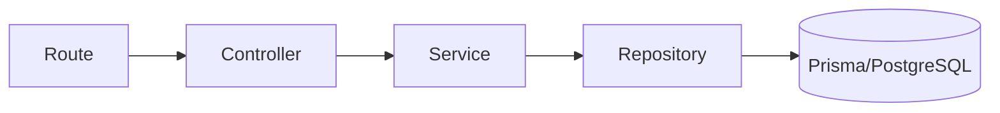
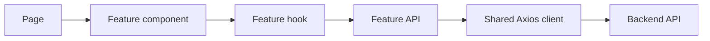

# 01. Kiến trúc code base

Tài liệu này mô tả kiến trúc hiện tại để tự triển khai từng phần bằng tay. Mục tiêu là ít tầng, dễ lần theo luồng code và chỉ thêm abstraction khi có nhu cầu thật.

## 1. Nguyên tắc

1. Frontend và backend là hai app độc lập.
2. Backend là modular monolith, không tách microservice.
3. Mỗi nghiệp vụ nằm trong một module; code dùng chung mới đưa vào `core/`.
4. Không tạo sẵn hàng loạt file rỗng hoặc interface chỉ có một implementation.
5. Route chỉ khai báo URL, middleware và controller.
6. Controller xử lý HTTP nhưng không chứa business logic và không gọi Prisma.
7. Service kh?ng ph? thu?c Express; service ???c ph?p g?i Prisma tr?c ti?p. Repository ch? d?ng khi c? persistence responsibility r? r?ng.
8. Mỗi file nên dưới 300 dòng. Khi dài, tách theo trách nhiệm thay vì tách máy móc.

## 2. Phân loại module backend

### 2.1 Platform core

Code hạ tầng dùng chung, không chứa luật nghiệp vụ của một tính năng cụ thể.

| Nhóm       | Vị trí               | Trách nhiệm                                         |
| ---------- | -------------------- | --------------------------------------------------- |
| Config     | `src/config/`        | Đọc và validate biến môi trường                     |
| Database   | `src/core/database/` | Prisma client và transaction helper khi thật sự cần |
| HTTP       | `src/core/http/`     | Response, error và status dùng chung                |
| Middleware | `src/middleware/`    | Xử lý concern chung của HTTP request                |
| Routes     | `src/routes/`        | Mount route của các module vào `/api/v1`            |

Endpoint vận hành gồm `/health` để kiểm tra process API và `/ready` để kiểm tra API có kết nối được PostgreSQL hay không.

Không đưa business rule như kiểm tra role, chính sách mật khẩu hoặc tính phí vào `core/`.

### 2.2 Business modules

Các module mô tả trực tiếp nghiệp vụ sản phẩm.

| Module   | Mục đích                                       | Mức ưu tiên                     |
| -------- | ---------------------------------------------- | ------------------------------- |
| `auth`   | Đăng ký, đăng nhập, refresh và logout          | Làm đầu tiên                    |
| `users`  | Hồ sơ người dùng và trạng thái tài khoản       | Sau auth                        |
| `access` | Role, permission và authorization policy       | Sau users                       |
| `files`  | Metadata, upload, download và xóa file         | Khi sản phẩm cần                |
| `audit`  | Ghi lại hành động bảo mật/nghiệp vụ quan trọng | Thêm cùng các thao tác quản trị |

`access` được tách khỏi `users` vì phân quyền là một concern riêng, nhưng chưa cần tách thành service độc lập.

### 2.3 Integration modules

Các module giao tiếp với dịch vụ bên ngoài.

| Module    | Mục đích                     | Quy tắc                                                                   |
| --------- | ---------------------------- | ------------------------------------------------------------------------- |
| `mail`    | Gửi email và render template | Business service chỉ yêu cầu gửi, không gọi SMTP trực tiếp                |
| `storage` | Local disk hoặc R2/S3        | Chỉ tạo interface khi có ít nhất hai driver                               |
| `oauth`   | Google hoặc provider khác    | Đặt riêng khi flow đủ lớn; nếu chỉ Google có thể nằm trong `auth/google/` |

### 2.4 Background modules

| Module | Mục đích                            | Quy tắc                               |
| ------ | ----------------------------------- | ------------------------------------- |
| `jobs` | Queue, scheduler và handler pg-boss | Chỉ worker xử lý job; API chỉ enqueue |

`server.ts` chỉ chạy HTTP API. `worker.ts` chỉ chạy background job. Không khởi động worker trong API process.

## 3. Cấu trúc một module tối giản

Không dùng một template cứng cho mọi module. Bắt đầu với cấu trúc nhỏ nhất:

```text
modules/auth/
├── auth.routes.ts
├── auth.controller.ts
├── auth.service.ts
├── auth.repository.ts
├── auth.schema.ts
└── auth.types.ts        # chỉ tạo nếu type dùng ở nhiều file
```

Luồng phụ thuộc mặc định:



### Route

- Khai báo HTTP method và URL.
- Gắn middleware validation, authentication và authorization.
- Trỏ request tới controller method.
- Không đọc/biến đổi dữ liệu request và không gọi service trực tiếp.

### Controller

- Đọc `params`, `query`, `body` và thông tin xác thực từ request.
- Gọi service method tương ứng.
- Chuyển kết quả service thành HTTP response.
- Không chứa business rule, không gọi Prisma và không tự truy vấn database.
- Nên mỏng; một controller method thường chỉ gồm lấy input, gọi service và trả response.

### Service

- Chứa use case và business rule.
- Không nhận `Request` hoặc `Response` của Express.
- Phối hợp repository và integration cần thiết.
- Throw application error; không tự gửi HTTP response.

### Repository

- Chỉ chứa truy vấn database.
- Không biết Express, HTTP status hoặc nội dung response.
- Tên method mô tả dữ liệu cần lấy, ví dụ `findUserByEmail`.

### Khi nào thêm policy?

Thêm `*.policy.ts` khi rule authorization hoặc rule trạng thái được dùng bởi nhiều service method. Policy là hàm thuần, dễ unit test và không gọi database.

## 4. Frontend theo feature

```text
src/features/auth/
├── api/
│   └── auth.api.ts
├── hooks/
│   └── use-auth.ts
├── components/
│   └── login-form.tsx
├── schemas/
│   └── login.schema.ts
└── types.ts             # chỉ tạo khi cần chia sẻ type
```

Luồng dữ liệu:



- `app/` chỉ routing, layout và ghép component.
- Component hiển thị UI và nhận event.
- Hook quản lý query/mutation và trạng thái server.
- API file là nơi duy nhất của feature gọi Axios.
- Không tạo global store cho dữ liệu đã được TanStack Query quản lý.

## 5. Cấu trúc mục tiêu

Chỉ tạo thư mục khi bắt đầu module tương ứng.

```text
backend/src/
├── app.ts
├── server.ts
├── worker.ts                 # tạo khi bắt đầu jobs
├── config/
├── core/
│   ├── database/
│   └── http/
├── middleware/
├── modules/
│   ├── auth/
│   ├── users/
│   ├── access/
│   ├── files/
│   ├── audit/
│   ├── mail/
│   └── jobs/
└── routes/

frontend/src/
├── app/
├── components/
│   ├── ui/
│   └── shared/
├── features/
├── lib/
│   ├── axios/
│   └── query/
└── types/
```

## 6. Thứ tự tự code đề xuất

Mỗi bước cần có route chạy được và ít nhất một test trước khi sang bước tiếp theo.

1. `system`: health check và format response — đã có.
2. `users`: model `User`, repository đọc/tạo user.
3. `auth/password`: đăng ký và đăng nhập bằng mật khẩu.
4. `session`: refresh token, logout và revoke session.
5. `access`: role/permission và middleware authorization.
6. `audit`: ghi lại login, đổi quyền và khóa tài khoản.
7. `mail`: email verification và reset password.
8. `files`: upload/download đơn giản bằng local storage.
9. `jobs`: chỉ thêm khi cần gửi mail hoặc cleanup bất đồng bộ.
10. OAuth, R2 và scheduler là phần mở rộng, không phải baseline đầu tiên.

## 7. Checklist cho má»—i endpoint

Trước khi coi một endpoint hoàn thành, trả lời được:

- Ai được gọi endpoint này?
- Input được validate ở đâu?
- HTTP mapping nằm ở controller nào?
- Business rule nằm ở service nào?
7. Service kh?ng ph? thu?c Express; service ???c ph?p g?i Prisma tr?c ti?p. Repository ch? d?ng khi c? persistence responsibility r? r?ng.
- Hai request đồng thời có làm sai dữ liệu không?
- Có test cho một ca thành công và một ca bị từ chối chưa?

## 8. Những thứ chưa nên thêm

- Generic repository hoặc base service.
- Dependency injection container.
- Event bus/CQRS chỉ để chuyển lời gọi trong cùng process.
- Redis, Kafka hoặc microservices.
- DTO mapper cho object chỉ có vài field.
- Interface cho class chỉ có một implementation và không cần mock.

Ưu tiên code cụ thể, tên rõ nghĩa và test được. Khi duplication xuất hiện thật từ hai nơi trở lên, lúc đó mới cân nhắc abstraction.
