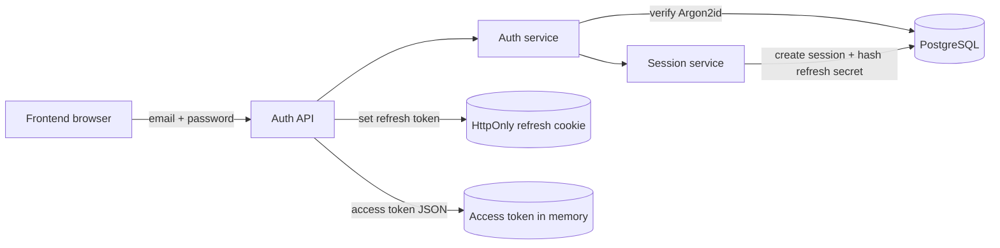
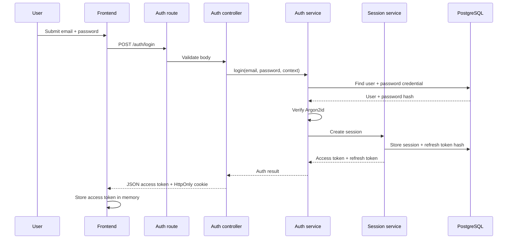
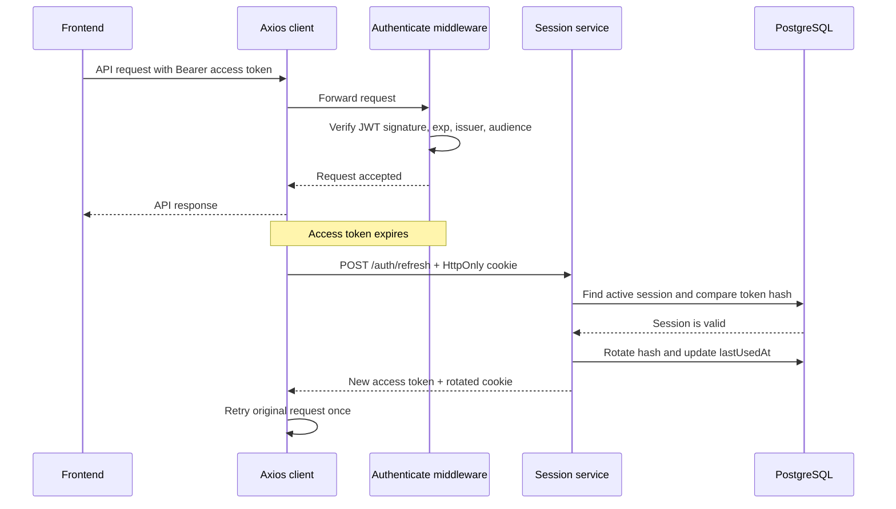
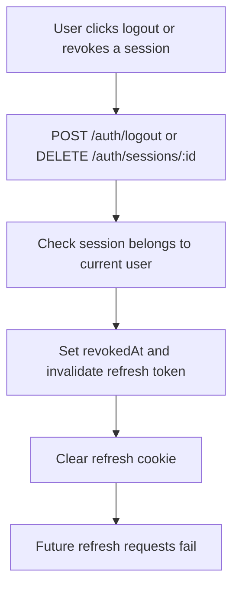

# Module 02 - Xác thực bằng mật khẩu và session

Module này cung cấp đăng ký, đăng nhập và phiên đăng nhập có thể thu hồi cho CoreStack.

## Kết quả

- Đăng ký bằng email và mật khẩu Argon2id.
- Đăng nhập tạo access token JWT RS256 sống ngắn.
- Refresh token ngẫu nhiên được lưu trong cookie `HttpOnly`.
- Database chỉ lưu SHA-256 hash của refresh token secret.
- Refresh token được xoay vòng sau mỗi lần sử dụng.
- Logout thu hồi session và xóa cookie.
- `/auth/me` trả user của access token hợp lệ.
- Frontend chỉ giữ access token trong bộ nhớ, không dùng `localStorage`.

## API

| Method | Endpoint | Chức năng |
| --- | --- | --- |
| `POST` | `/api/v1/auth/register` | Tạo user và password credential |
| `POST` | `/api/v1/auth/login` | Xác minh mật khẩu, tạo session và cookie |
| `POST` | `/api/v1/auth/refresh` | Xoay vòng refresh token và trả access token mới |
| `POST` | `/api/v1/auth/logout` | Thu hồi session và xóa cookie |
| `GET` | `/api/v1/auth/me` | Trả user hiện tại; yêu cầu Bearer access token |

## Luồng đăng nhập

```text
Frontend
  -> POST /auth/login
  -> authService xác minh Argon2id
  -> Session service tạo session
  -> Backend trả access token trong JSON
  -> Backend đặt refresh token trong HttpOnly cookie
```

## Luồng refresh

```text
Access token hết hạn
  -> Axios nhận 401 từ request đã có Bearer token
  -> POST /auth/refresh bằng HttpOnly cookie
  -> Backend kiểm tra session và refresh token hash
  -> Conditional update thay hash cũ bằng hash mới
  -> Frontend giữ access token mới trong bộ nhớ
  -> Axios retry request ban đầu tối đa một lần
```

Nhiều request 401 đồng thời dùng chung một refresh Promise. Request login, register, refresh và logout không kích hoạt interceptor refresh để tránh vòng lặp.

## Quy tắc bảo mật

- Private key chỉ ký JWT; public key dùng để xác minh.
- Access token chứa `sub` là user ID và `sid` là session ID.
- Refresh token có dạng `sessionId.secret`; chỉ hash của `secret` được lưu.
- Cookie dùng `HttpOnly`, `SameSite=Lax` và `Secure` trong production.
- Logout có tính idempotent: cookie vẫn được xóa khi token thiếu hoặc không hợp lệ.
- Middleware kiểm tra cả chữ ký JWT, session, thời hạn và trạng thái user.
- Không log hoặc trả password hash, private key hay refresh token trong JSON.

## Cấu hình môi trường

```env
JWT_PRIVATE_KEY_BASE64=
JWT_PUBLIC_KEY_BASE64=
JWT_ISSUER=corestack-api
JWT_AUDIENCE=corestack-web
JWT_ACCESS_TTL_SECONDS=900
REFRESH_TOKEN_TTL_DAYS=30
```

## Ranh giá»›i module

Backend giữ luồng:

```text
Route -> Middleware -> Controller -> Service -> Prisma (repository ch? d?ng khi c?n persistence boundary)
```

Frontend giữ luồng:

```text
Provider/Component -> Hook -> Feature API -> Axios client -> Backend
```

Module hiện đã triển khai password authentication, email verification và Google OAuth. Magic link và reset password chưa thuộc scope; role/permission nằm ở module authorization.

## Gi?i h?n thi?t b? v� qu?n l� phi�n

Bi?n MAX_ACTIVE_SESSIONS_PER_USER (m?c d?nh 5) gi?i h?n s? phi�n ho?t d?ng c?a m?i user. Khi dang nh?p vu?t gi?i h?n, c�c phi�n cu nh?t b? revoke; refresh token c?a ch�ng kh�ng c�n h?p l?.


## Stateless access token v? session policy

M?i l?n login th?nh c?ng t?o m?t session ri?ng; kh?ng nh?n di?n ho?c reuse session theo thi?t b?. M?t user c? t?i ?a 5 session active; khi v??t gi?i h?n, session c? nh?t b? revoke.

Middleware authenticate ch? verify ch? k? JWT, `exp`, issuer v? audience r?i g?n identity v?o request; kh?ng lookup session DB tr?n m?i request. Session DB ch? qu?n l? refresh lifecycle, danh s?ch session v? revoke.

Revoking a session prevents future refreshes for that login session. Already-issued access tokens remain valid until their short expiration time.

On rotation, store the previous token hash in `previousRefreshTokenHash` and update `lastUsedAt`. Accept the previous token for 30 seconds; reuse after that revokes the session.

Session HTTP handlers n?m trong `session.controller.ts`; token infrastructure n?m trong `session.tokens.ts`. Session service g?i Prisma tr?c ti?p v? gi? transaction audit, gi?i h?n session v? conditional refresh rotation.
## Dat va doi mat khau

`GET /api/v1/auth/me` tra `user.hasPassword` ma khong tra password hash.
Tai khoan chua co `PasswordCredential` (vi du dang ky qua Google) co the dat
mat khau qua `POST /api/v1/auth/password/change` khi da dang nhap: body chi can
`newPassword` (12-128 ky tu). Tai khoan da co mat khau phai gui them
`currentPassword` dung. Giao dien tai lai `/auth/me` sau khi dat mat khau.

## Sơ đồ tổng quan auth và session

Sơ đồ này cho thấy nơi lưu từng loại token và điểm kiểm tra chính trong một request đã đăng nhập:



## Sơ đồ đăng nhập



## Sơ đồ sử dụng session và refresh



## Sơ đồ logout và thu hồi session



### Ý nghĩa của từng token

| Thành phần | Nơi lưu | Mục đích | Khi bị thu hồi |
| --- | --- | --- | --- |
| Access token | Memory của frontend | Gửi trong `Authorization: Bearer` | Vẫn có hiệu lực đến khi hết hạn ngắn |
| Refresh token | `HttpOnly` cookie | Xin access token mới | Không thể refresh thêm |
| Refresh token hash | Database | Đối chiếu token và rotation | Bị thay bằng hash mới sau mỗi lần refresh |
| Session record | Database | Quản lý thiết bị, revoke và giới hạn session | `revokedAt` được ghi nhận |
