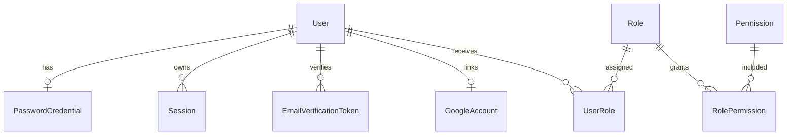

# Database Reference

Tài liệu này mô tả schema PostgreSQL hiện tại của CoreStack. Nguồn chính xác cuối cùng vẫn là `backend/prisma/schema.prisma` và các migration trong `backend/prisma/migrations/`.

## 1. Tổng quan

Database hiện lưu bốn nhóm dữ liệu:

- Identity: `User`, `PasswordCredential`.
- Authentication session: `Session`.
- Email verification: `EmailVerificationToken`.
- Google OAuth: `GoogleAccount`, `GoogleOAuthAttempt`.
- Authorization RBAC: `Role`, `Permission`, `UserRole`, `RolePermission`.



## 2. User

`User` là identity gốc. Credential, session và role đều tham chiếu tới bản ghi này.

| Field | Kiểu | Ràng buộc | Ý nghĩa |
| --- | --- | --- | --- |
| `id` | UUID | Primary key | Định danh nội bộ |
| `email` | String | Unique | Email đăng nhập đã được chuẩn hóa |
| `displayName` | String? | Nullable | Tên hiển thị |
| `status` | `UserStatus` | Mặc định `ACTIVE` | Trạng thái tài khoản |
| `emailVerifiedAt` | DateTime? | Nullable | Thời điểm xác minh email |
| `createdAt` | DateTime | Mặc định `now()` | Thời điểm tạo |
| `updatedAt` | DateTime | `@updatedAt` | Tự cập nhật khi bản ghi thay đổi |

`UserStatus` hiện có:

```text
ACTIVE
SUSPENDED
```

Email được chuẩn hóa bằng `trim().toLowerCase()` tại service trước khi ghi database. Unique index là lớp bảo vệ cuối cùng chống đăng ký trùng email.

## 3. PasswordCredential

`PasswordCredential` tách mật khẩu khỏi bảng identity.

| Field | Kiểu | Ràng buộc | Ý nghĩa |
| --- | --- | --- | --- |
| `userId` | UUID | Primary key, foreign key | User sở hữu credential |
| `passwordHash` | String | Bắt buộc | Argon2id hash, không phải mật khẩu gốc |
| `createdAt` | DateTime | Mặc định `now()` | Thời điểm tạo credential |
| `updatedAt` | DateTime | `@updatedAt` | Thời điểm hash được cập nhật |

Quan hệ `User` và `PasswordCredential` là một-một tùy chọn. Cấu trúc này cho phép một identity tồn tại mà không bắt buộc phải dùng mật khẩu khi bổ sung OAuth hoặc magic link sau này.

Khi user bị xóa, credential bị xóa theo nhờ `ON DELETE CASCADE`.

## 4. Session

Mỗi lần đăng nhập thành công tạo một `Session` riêng.

| Field | Kiểu | Ràng buộc | Ý nghĩa |
| --- | --- | --- | --- |
| `id` | UUID | Primary key | Đồng thời là `sid` trong access token |
| `userId` | UUID | Foreign key, index | User sở hữu session |
| `refreshTokenHash` | `VARCHAR(64)` | Unique | SHA-256 hash của refresh token secret |
| `expiresAt` | DateTime | Index | Thời điểm session hết hạn |
| `revokedAt` | DateTime? | Nullable | Có giá trị khi session bị thu hồi |
| `createdAt` | DateTime | Mặc định `now()` | Thời điểm đăng nhập |
| `updatedAt` | DateTime | `@updatedAt` | Lần cập nhật gần nhất |

Database không lưu refresh token gốc. Token phía browser có dạng:

```text
sessionId.secret
```

Chỉ SHA-256 hash của `secret` được lưu trong `refreshTokenHash`. Khi refresh, backend dùng conditional update để thay hash cũ bằng hash mới; vì vậy cùng một refresh token không thể được sử dụng thành công hai lần.

Session được xem là không hợp lệ khi:

- `revokedAt` đã có giá trị.
- `expiresAt` nhỏ hơn hoặc bằng thời điểm hiện tại.
- User không còn trạng thái `ACTIVE`.
- Refresh token secret không khớp hash đang lưu.

Xóa user sẽ xóa toàn bộ session của user đó nhờ `ON DELETE CASCADE`.

### EmailVerificationToken

`EmailVerificationToken` lưu token dùng một lần để xác minh địa chỉ email. Database chỉ lưu SHA-256 hash, không lưu raw token được gửi trong email.

| Field | Kiểu | Ràng buộc | Ý nghĩa |
| --- | --- | --- | --- |
| `id` | UUID | Primary key | Định danh token record |
| `userId` | UUID | Foreign key, index cùng `createdAt` | User sở hữu token |
| `tokenHash` | `VARCHAR(64)` | Unique | SHA-256 hash của raw token |
| `expiresAt` | DateTime | Index | Thời điểm token hết hạn |
| `consumedAt` | DateTime? | Nullable | Thời điểm token đã được dùng |
| `createdAt` | DateTime | Mặc định `now()` | Thời điểm phát hành token |

Khi gửi lại email, token chưa dùng cũ bị xóa trước khi tạo token mới. Khi xác minh, conditional update `consumedAt = null` và cập nhật `User.emailVerifiedAt` chạy trong cùng transaction để chống sử dụng đồng thời. Xóa user sẽ xóa token theo `ON DELETE CASCADE`.

### GoogleAccount

`GoogleAccount` liên kết tối đa một Google identity với một `User`. `googleSubject` lấy từ claim `sub` đã xác minh, không dùng email làm định danh provider.

| Field | Kiểu | Ràng buộc | Ý nghĩa |
| --- | --- | --- | --- |
| `id` | UUID | Primary key | Định danh liên kết |
| `userId` | UUID | Unique, foreign key | User được liên kết |
| `googleSubject` | `VARCHAR(255)` | Unique | Google `sub` |
| `createdAt` | DateTime | Mặc định `now()` | Thời điểm tạo |
| `updatedAt` | DateTime | `@updatedAt` | Thời điểm cập nhật |

Xóa user sẽ xóa liên kết theo `ON DELETE CASCADE`.

### GoogleOAuthAttempt

`GoogleOAuthAttempt` lưu trạng thái ngắn hạn của Authorization Code + PKCE. Chỉ hash SHA-256 của state được lưu; `codeVerifier` được giữ tạm để đổi authorization code và không được log hoặc trả qua API.

| Field | Kiểu | Ràng buộc | Ý nghĩa |
| --- | --- | --- | --- |
| `id` | UUID | Primary key | Định danh attempt |
| `stateHash` | `VARCHAR(64)` | Unique | SHA-256 hash của state |
| `codeVerifier` | `VARCHAR(128)` | Bắt buộc | PKCE verifier tạm thời |
| `expiresAt` | DateTime | Index | Thời điểm hết hạn |
| `consumedAt` | DateTime? | Nullable | Thời điểm đã dùng |
| `createdAt` | DateTime | Mặc định `now()` | Thời điểm tạo |

Attempt được consume bằng conditional update khi còn hạn và chưa dùng, nên một state chỉ thành công một lần.

## 5. Role và Permission

### Role

| Field | Kiểu | Ràng buộc | Ý nghĩa |
| --- | --- | --- | --- |
| `id` | UUID | Primary key | Định danh nội bộ |
| `code` | `VARCHAR(50)` | Unique | Mã ổn định như `ADMIN` |
| `name` | `VARCHAR(100)` | Bắt buộc | Tên hiển thị |
| `description` | String? | Nullable | Mô tả role |
| `createdAt` | DateTime | Mặc định `now()` | Thời điểm tạo |
| `updatedAt` | DateTime | `@updatedAt` | Thời điểm cập nhật |

### Permission

| Field | Kiểu | Ràng buộc | Ý nghĩa |
| --- | --- | --- | --- |
| `id` | UUID | Primary key | Định danh nội bộ |
| `code` | `VARCHAR(100)` | Unique | Mã như `users:read` |
| `description` | String? | Nullable | Ý nghĩa permission |
| `createdAt` | DateTime | Mặc định `now()` | Thời điểm tạo |
| `updatedAt` | DateTime | `@updatedAt` | Thời điểm cập nhật |

`code` mới là định danh nghiệp vụ ổn định. Application không phụ thuộc vào UUID cụ thể của role hoặc permission.

## 6. Các bảng nối RBAC

### UserRole

`UserRole` biểu diễn quan hệ nhiều-nhiều giữa user và role.

| Field | Kiểu | Ràng buộc |
| --- | --- | --- |
| `userId` | UUID | Foreign key tới `User` |
| `roleId` | UUID | Foreign key tới `Role`, có index |
| `createdAt` | DateTime | Mặc định `now()` |

Primary key ghép `(userId, roleId)` ngăn cùng một role bị gán lặp cho một user.

### RolePermission

`RolePermission` biểu diễn quan hệ nhiều-nhiều giữa role và permission.

| Field | Kiểu | Ràng buộc |
| --- | --- | --- |
| `roleId` | UUID | Foreign key tới `Role` |
| `permissionId` | UUID | Foreign key tới `Permission`, có index |
| `createdAt` | DateTime | Mặc định `now()` |

Primary key ghép `(roleId, permissionId)` ngăn cùng một permission bị thêm lặp vào role.

Các foreign key của hai bảng nối dùng `ON DELETE CASCADE`. Xóa một đầu quan hệ sẽ dọn bản ghi nối tương ứng, không xóa đối tượng ở đầu còn lại.

## 7. Role nền tảng

Seed tạo hai role:

| Role | Permission |
| --- | --- |
| `MEMBER` | `profile:read:self`, `profile:update:self` |
| `ADMIN` | Toàn bộ permission nền tảng, gồm `users:read`, `users:update`, `users:suspend`, `roles:manage` |

User đăng ký mới được gán `MEMBER` trong cùng nested create với `User` và `PasswordCredential`.

Seed có tính idempotent:

- Role và permission được `upsert` theo `code`.
- Quan hệ được tạo với `skipDuplicates`.
- User cũ được bổ sung role `MEMBER` nếu còn thiếu.
- `RBAC_SUPER_ADMIN_EMAIL` có thể gán thêm role `SUPER_ADMIN` cho một user đã tồn tại.

## 8. Dữ liệu nhạy cảm

Không được log hoặc trả qua API:

- `PasswordCredential.passwordHash`.
- `Session.refreshTokenHash`.
- `EmailVerificationToken.tokenHash`.
- Refresh token gốc.
- Raw email verification token và URL chứa token.
- JWT private key hoặc secret cấu hình.

Repository trả dữ liệu theo use case, không mặc định mở toàn bộ relation nhạy cảm.

## 9. AuditLog

`AuditLog` lưu sự kiện bảo mật và quản trị theo mô hình append-only ở application layer.

| Field | Kiểu | Ý nghĩa |
| --- | --- | --- |
| `id` | UUID | Khóa chính |
| `action` | `VARCHAR(100)` | Mã sự kiện ổn định |
| `outcome` | `AuditOutcome` | `SUCCESS` hoặc `FAILURE` |
| `actorUserId` | UUID? | Snapshot user thực hiện hành động |
| `subjectType` | `VARCHAR(50)`? | Loại đối tượng chịu tác động |
| `subjectId` | `VARCHAR(100)`? | Snapshot ID đối tượng |
| `sessionId` | UUID? | Session liên quan |
| `ipAddress` | `VARCHAR(45)`? | IPv4 hoặc IPv6 đã chuẩn hóa |
| `userAgent` | `VARCHAR(512)`? | User-Agent đã giới hạn độ dài |
| `metadata` | JSONB? | Dữ liệu không nhạy cảm theo event |
| `createdAt` | DateTime | Thời điểm ghi event |

Audit log không có `updatedAt`, foreign key hoặc API update/delete. Snapshot vẫn còn khi user hoặc session nguồn bị xóa.

Session login/logout và audit event tương ứng được ghi trong cùng Prisma transaction. Login thất bại cũng được ghi nhưng không lưu email không tồn tại, password hoặc token.

## 10. Migration hiện có

| Migration | Thay đổi |
| --- | --- |
| `20260920000000_baseline` | Tạo bảng `User` |
| `20260921164503_extend_user_identity` | Thêm tên hiển thị, trạng thái và thời điểm xác minh email |
| `20260922081132_add_password_credential` | Tạo credential mật khẩu một-một |
| `20260923100901_add_session` | Tạo session có thể refresh và revoke |
| `20260924175337_add_rbac` | Tạo role, permission và hai bảng nối |
| `20260926033703_add_audit_log` | Tạo enum outcome, bảng audit append-only và index timeline |
| `20260926041252_add_email_verification_token` | Tạo token hash dùng một lần, thời hạn và quan hệ cascade với user |

Không sửa migration đã được áp dụng. Thay đổi schema mới phải tạo migration mới và được review trước khi deploy.

## 11. Quy trình thay đổi database

1. Sửa `backend/prisma/schema.prisma`.
2. Tạo migration mới ở môi trường development.
3. Review SQL sinh ra, đặc biệt với `DROP`, đổi kiểu và cột `NOT NULL`.
4. Chạy `pnpm db:generate`.
5. Chạy migration trên database thử nghiệm bằng `pnpm db:migrate:deploy`.
6. Cập nhật seed nếu thay đổi catalog hoặc dữ liệu nền tảng.
7. Chạy backend lint, typecheck, test và build.
8. Cập nhật tài liệu này nếu contract persistence thay đổi.

Không dùng `prisma migrate reset` với database chứa dữ liệu cần giữ. Production phải chạy migration bằng bước triển khai riêng trước khi khởi động API mới.

## 12. Chưa có trong schema

Các phần sau chưa được triển khai:

- Password reset token.
- OAuth account.
- Organization hoặc tenant.

Chỉ thêm model khi bắt đầu use case tương ứng; không tạo bảng dự phòng chưa có hành vi sử dụng.

