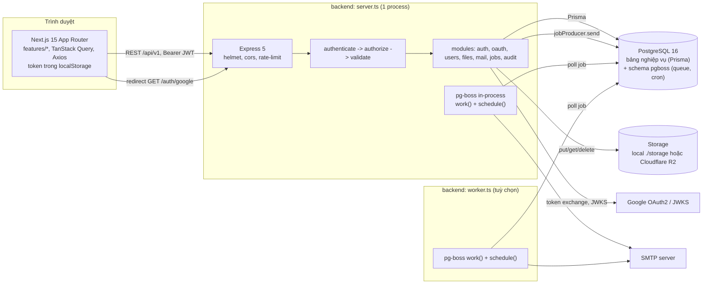
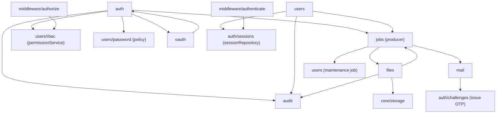
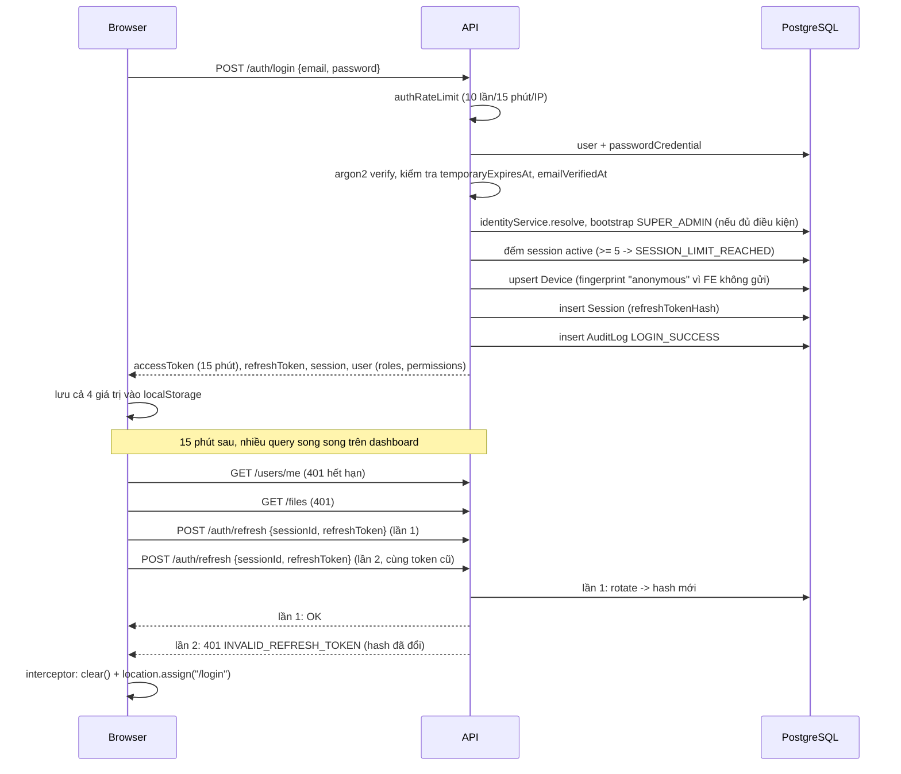
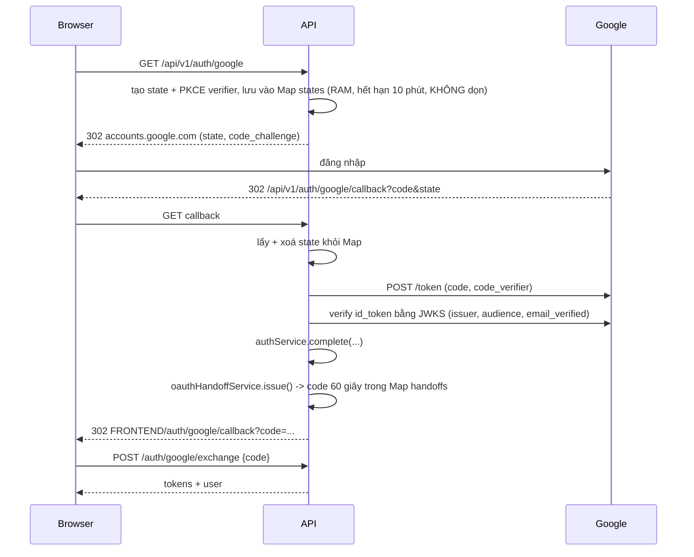
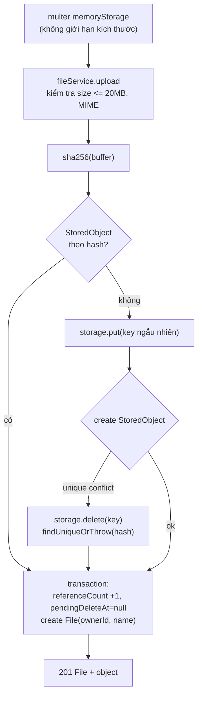
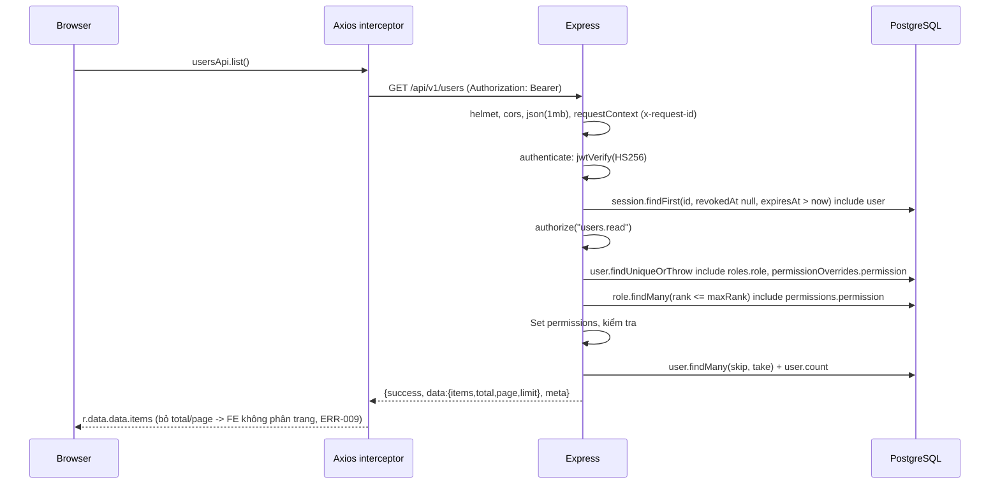

# 02. Tư duy hệ thống

Mục tiêu của báo cáo này là nhìn CoreStack như **một hệ thống hoàn chỉnh** thay vì từng file: cái gì phụ thuộc cái gì, dữ liệu đi qua đâu, lỗi lan truyền như thế nào, và chỗ nào là điểm nghẽn.

## 1. Các thành phần của hệ thống



Nhận xét quan trọng về hình trên:

- **PostgreSQL là trái tim và cũng là điểm lỗi đơn** (single point of failure): nó vừa là database nghiệp vụ, vừa là hàng đợi (pg-boss), vừa là nơi lưu lịch cron. Mất Postgres thì auth, jobs, mail, cleanup đều dừng. Ở quy mô hiện tại, đây là lựa chọn hợp lý (spec yêu cầu không dùng Redis), miễn là hiểu rõ hệ quả khi vận hành.
- **API server và worker đều chạy pg-boss** (`server.ts` gọi `jobService.start()`, `registerJobs()`, `registerSchedules()`). Nghĩa là API server cũng là consumer của mọi hàng đợi. Điều này trái với đặc tả ("`server.ts` chỉ HTTP API") và trái với `docs/architecture/jobs.md`. Xem ARCH-002.
- **Ba loại trạng thái nằm trong RAM của process API**: `states` Map của Google OAuth, `handoffs` Map của handoff code, và bộ đếm của `express-rate-limit`. Hệ quả: chỉ chạy đúng với **một** instance API; restart là mất trạng thái. `docs/architecture/auth.md` có thừa nhận điều này cho handoff, nhưng không nói về `states` và rate limit.

## 2. Quan hệ và phụ thuộc giữa các module backend



Có hai **vòng phụ thuộc** đáng chú ý:

1. `auth` ↔ `users`: `auth.service` cần `permissionService` (users), còn `users/password.service` và `users/user.service` cần `sessionRepository` (auth). ESM cho phép, nhưng về mặt thiết kế, hai module này không còn ranh giới rõ; muốn tách `auth` sang dự án khác (như `docs/architecture/oauth-module.md` mô tả) sẽ kéo theo `users`.
2. `jobs` ↔ `files`/`mail`: `jobs` vừa là hạ tầng (producer) vừa import handler nghiệp vụ. Đây là kiểu phụ thuộc chấp nhận được nếu tách rõ `jobs/core` và `jobs/handlers`, nhưng hiện tại `job.service` (hạ tầng) và `job.controller` (API quản trị) nằm chung.

## 3. Luồng nghiệp vụ quan trọng

### 3.1 Đăng nhập bằng mật khẩu và làm mới token



Điểm cần rút ra: backend làm rotation đúng, nhưng frontend **không có hàng đợi refresh** (ERR-003), nên một hành vi đúng ở backend lại gây đăng xuất ngoài ý muốn ở frontend. Đây là ví dụ kinh điển của việc lỗi chỉ lộ ra khi nhìn toàn hệ thống.

### 3.2 Google OAuth và handoff



Luồng này đúng về bảo mật. Vấn đề nằm ở **vòng đời của `states`**: mỗi lần gọi `GET /auth/google` thêm một phần tử, chỉ bị xoá khi callback về. Ai gọi endpoint này liên tục (không có rate limit) sẽ làm Map lớn vô hạn (SEC-005).

### 3.3 Upload tệp có khử trùng lặp



Luồng này được thiết kế tốt (xử lý race hai upload cùng hash). Điểm yếu là **thứ tự kiểm tra**: kích thước chỉ được kiểm tra sau khi multer đã đọc toàn bộ tệp vào RAM (SEC-004).

### 3.4 Xoá tệp và dọn orphan

```
DELETE /files/:id
  -> softDelete (transaction): File.deletedAt = now; StoredObject.referenceCount -1; pendingDeleteAt = now
  -> AuditLog FILE_DELETED

Job files.cleanup-orphans (cron 0 2 * * *) hoặc POST /files/orphans/cleanup {force}
  -> tìm StoredObject referenceCount = 0 và (pendingDeleteAt <= cutoff hoặc createdAt <= cutoff)
  -> với mỗi object: storage.delete(key)   <-- xoá vật lý TRƯỚC
                     transaction: kiểm tra lại referenceCount === 0, xoá File đã soft-delete, xoá StoredObject
```

Có một **khoảng trống giữa `storage.delete` và transaction**: nếu trong khoảng đó một upload cùng hash hoặc một lệnh "Dùng lại" tăng `referenceCount`, transaction sẽ bỏ qua (đúng), nhưng tệp vật lý đã mất. Kết quả: bản ghi `StoredObject` tồn tại, download lỗi 500 (ERR-005). Quy tắc chung: **thay đổi trạng thái trong DB trước, xoá tài nguyên ngoài sau**, hoặc đánh dấu "đang xoá" rồi mới xoá.

### 3.5 Đăng ký tài khoản và xác minh email

```
POST /auth/register -> tạo User (chưa verify) + PasswordCredential -> challenge EMAIL_VERIFY (20 phút)
                    -> job mail.send (link = req.protocol://req.host/api/v1/auth/register/verify?...)
GET  /auth/register/verify -> consume challenge -> emailVerifiedAt = now -> redirect FE
POST /auth/login -> nếu emailVerifiedAt null -> 403 EMAIL_NOT_VERIFIED
```

Ba mắt xích yếu nối nhau thành một "ngõ cụt" (ERR-006): không có API gửi lại link; đăng ký lại bị 409; đăng nhập OTP cho user đã tồn tại không set `emailVerifiedAt`. Sau 20 phút, nếu người dùng chưa bấm link (hoặc SMTP chưa cấu hình nên mail không đi), tài khoản đó bị kẹt vĩnh viễn trừ khi admin can thiệp trực tiếp DB.

### 3.6 Lịch công việc động

```
seed -> 5 bản ghi ScheduledJob
server.ts / worker.ts khởi động -> registerJobs (work() cho 9 queue) -> syncSchedulesFromDb -> boss.schedule(queue, cron, payload)
API /jobs/schedules (chỉ authenticate) -> create/update/delete -> boss.schedule/unschedule theo queue
POST /jobs/schedules/:id/run -> boss.send(queue, payload)
```

Hai điểm nghẽn tư duy ở đây:

1. pg-boss định danh lịch theo **tên queue**, còn bảng `ScheduledJob` cho phép nhiều bản ghi cùng queue. Hai lịch cùng queue sẽ ghi đè nhau và `unschedule` của bản ghi này xoá cron của bản ghi kia (ARCH-002).
2. Vì API jobs không kiểm tra quyền và cho phép nhập `queue` tự do, bất kỳ ai đăng nhập được cũng có thể đẩy payload vào `mail.send` (gửi email từ hệ thống) hoặc `users.update-inactive` (SEC-001).

## 4. Luồng dữ liệu end-to-end: một request được bảo vệ



Mỗi request được bảo vệ tốn **tối thiểu 3 query** trước khi chạm vào nghiệp vụ. Ở quy mô hiện tại điều này chấp nhận được; xem `09-HIEU-NANG-VA-KHA-NANG-MO-RONG.md`.

## 5. Luồng lỗi

- Backend: mọi lỗi đi qua `errorMiddleware`; `ZodError` → 400 `VALIDATION_ERROR`; `ApiError` → status/code tương ứng; lỗi khác → 500 và log stack. Đây là thiết kế đúng. Điểm chưa nhất quán: một số nơi `throw new Error(...)` thay vì `ApiError` (job.service `triggerNow`, `updateSchedule`, `deleteSchedule`; password-reset `confirm`) nên client nhận 500 thay vì 404/400.
- Job handler: `cleanupOrphans` nuốt mọi lỗi (`catch {}`), chỉ ghi chú "retry lần sau". Không log, không metric → vận hành không biết cleanup đang thất bại.
- Frontend: lỗi API được lấy qua `apiError()` hoặc tự bóc `err.response.data.error.message` lặp lại ở nhiều chỗ; nhiều nơi dùng `alert()`. Interceptor xử lý 401 quá "hung hăng" (ERR-002).

## 6. Điểm nghẽn, điểm lỗi đơn và ảnh hưởng dây chuyền

| Điểm | Loại | Ảnh hưởng dây chuyền |
| --- | --- | --- |
| PostgreSQL | SPOF | Mất DB: auth 500 (mọi request cần session lookup), jobs dừng, mail dừng, cleanup dừng |
| Process API duy nhất | Trạng thái in-memory | Restart giữa chừng OAuth → "Invalid OAuth state"; scale 2 instance → OAuth/handoff hỏng ngẫu nhiên; rate limit tính riêng từng instance |
| SMTP | Phụ thuộc ngoài | SMTP chết → job `mail.send` thất bại theo retry mặc định của pg-boss; đăng ký/OTP/magic link không hoàn tất; không có cảnh báo |
| Storage local trong container | Dữ liệu ephemeral | Không có volume trong compose/Dockerfile → redeploy mất tệp (OPS-002) |
| `jobService.started` cache promise bị reject | Lỗi khởi động | Nếu `boss.start()` fail lúc boot (DB chưa sẵn sàng), mọi `send()` sau đó fail cho đến khi restart (ERR-008) |
| Router `files`/`jobs` không authorize | Bảo mật | Một tài khoản MEMBER (hoặc user mới, rank 0) có thể gửi mail, xoá orphan, khoá user hàng loạt qua job |
| Migration thiếu | Triển khai | DB dựng từ migration → login lỗi cột `mustChangePassword`, seed lỗi bảng `ScheduledJob` (DB-001) |

## 7. Khả năng mở rộng, bảo trì, kiểm thử, triển khai, vận hành

| Tiêu chí | Đánh giá | Căn cứ |
| --- | --- | --- |
| Mở rộng tính năng | Trung bình | Module hoá tốt ở backend; nhưng permission catalog nằm rải rác ở 4 nơi (CODE-002) nên thêm quyền mới phải sửa nhiều chỗ |
| Mở rộng quy mô | Thấp | Trạng thái in-memory; scheduler in-process; không cache |
| Bảo trì | Thấp–Trung bình | 82/207 file viết 1 dòng; component FE 700–1100 dòng; tài liệu mâu thuẫn |
| Kiểm thử | Trung bình | Có 17 file test backend, nhưng không test authorize theo route, không test jobs/files API; FE 2 test |
| Triển khai | Thấp | Migration thiếu; Dockerfile FE thiếu ARG/config; không CI |
| Vận hành | Thấp | Log console, không structured; không health check DB; không metrics; không backup script |

## 8. Mức độ nhất quán giữa yêu cầu, thiết kế và code

| Yêu cầu (CODEX_PROJECT_SETUP) | Code thực tế | Trạng thái |
| --- | --- | --- |
| `server.ts` chỉ HTTP; `worker.ts` chạy jobs | `server.ts` khởi động cả worker+scheduler | Lệch |
| Storage `s3.storage.ts` hỗ trợ custom endpoint (MinIO) | Chỉ `r2.storage.ts` với endpoint Cloudflare cố định | Lệch (có tài liệu hoá) |
| Authorization = Permission + Rank + Policy ở mọi route | Chỉ users, mail có `authorize` | Lệch nghiêm trọng |
| Không hard-code role check | FE dùng `rank >= 100` / `name === "SUPER_ADMIN"` (chấp nhận được ở FE), backend dùng `role.name === "SUPER_ADMIN"` và `targetRank === 100` trong `user.service` | Một phần |
| < 300 dòng/file, hard limit 500 | 5 file FE > 500 dòng, lớn nhất 1100 | Lệch |
| Controller không gọi Prisma | `auth.controller`, `user.controller`, `mail.controller` gọi Prisma | Lệch |
| Docs mô tả kiến trúc | `docs/` 1–3 đoạn mỗi file, `jobs.md` mô tả sai | Lệch |
| README chỉ tick khi đã verify | Nhiều mục tick nhưng code cho thấy chưa đúng | Lệch |
