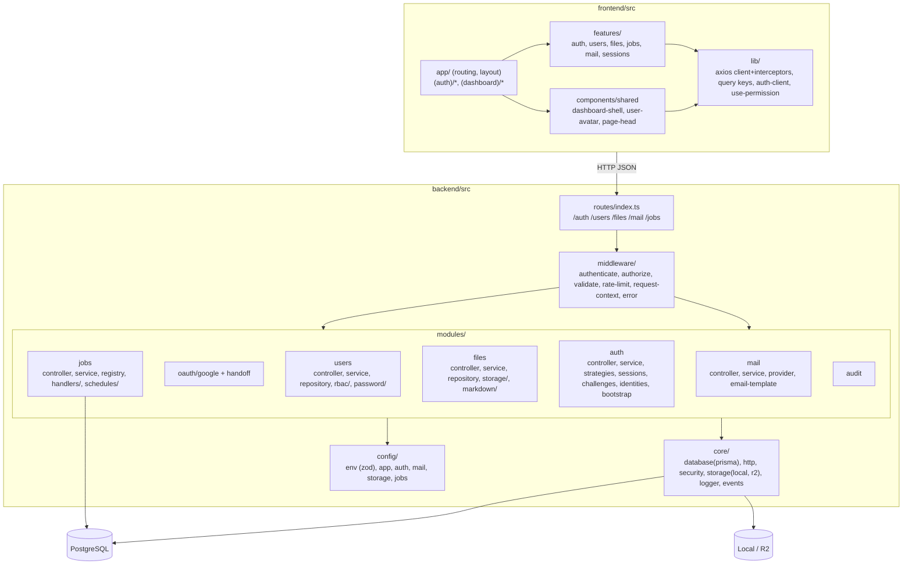
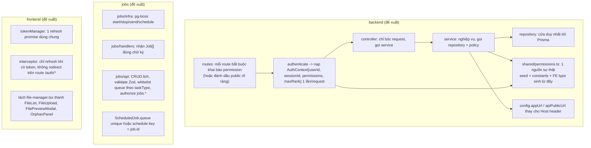

# 03. Kiến trúc hiện tại

## 1. Kiểu kiến trúc đang sử dụng

- **Tổng thể**: hai ứng dụng độc lập (frontend Next.js, backend Express) giao tiếp bằng REST JSON, không dùng monorepo workspace (đúng với đặc tả).
- **Backend**: *modular monolith* theo mô hình phân tầng trong từng module: `routes → controller → service → repository → Prisma`. Có lớp `core/` (database, http, security, storage, logger, events) và `middleware/`.
- **Frontend**: *feature-based*: `app/` chỉ định tuyến, `features/<tên>/{api,hooks,components,types}`, `lib/` chứa axios/query/auth client, `components/shared` dùng chung.
- **Nền**: PostgreSQL vừa là DB vừa là queue (pg-boss). Không có Redis, không có message broker riêng.

Mức độ phù hợp: **phù hợp với quy mô "base project" và với năng lực một người/nhóm nhỏ**. Không có dấu hiệu chọn kiến trúc quá phức tạp (microservice, CQRS, event sourcing). Vấn đề không nằm ở kiểu kiến trúc mà ở **kỷ luật thực thi** kiến trúc đã chọn.

## 2. Sơ đồ kiến trúc hiện tại

## 3. Ranh giới module và các tầng

### 3.1 Backend: tầng nào đang làm việc của tầng nào

| Tầng | Kỳ vọng theo spec | Thực tế | Bằng chứng |
| --- | --- | --- | --- |
| Route | Khai báo endpoint + middleware | Đúng | `user.routes.ts`, `mail.routes.ts` rõ ràng |
| Controller | Bóc request, gọi service, trả response | **Chứa nghiệp vụ và gọi Prisma** | `auth.controller.ts`: `requestOtp`/`requestMagic` tự tìm user, tự tạo challenge, tự dựng URL, tự gửi job; `revoke` query `prisma.session` trực tiếp. `user.controller.ts`: `me` và `roles` gọi Prisma. `mail.controller.ts`: toàn bộ nghiệp vụ gửi mail, query audit, tạo OTP nằm trong controller |
| Service | Nghiệp vụ, điều phối repository | Đa số gọi Prisma trực tiếp, bỏ qua repository | `auth.service.ts`, `user.service.ts`, `role.service.ts`, `password.service.ts`, `identity.service.ts`, `registration.service.ts`, `password-reset.service.ts` |
| Repository | Truy cập dữ liệu | Có nhưng mỏng và không nhất quán: `sessionRepository`, `challengeRepository`, `fileRepository`, `scheduledJobRepository`, `userRepository` tồn tại; nhiều service vẫn đi tắt | `userRepository` có `list/count/detail/update/maxRank` nhưng `user.service.setBlocked` dùng `prisma.user.update` |

Bài học: kiến trúc phân tầng chỉ có giá trị khi **mọi truy cập dữ liệu đi qua một cửa**. Khi một nửa đi qua repository và một nửa đi thẳng Prisma, ta mất cả hai lợi ích: không mock được dễ dàng (test phải `vi.mock` Prisma sâu, xem `10`), và không có chỗ duy nhất để thêm rule (soft-delete, tenant, audit).

### 3.2 Frontend: quy tắc "Component → hook → Query → API → Axios"

| Quy tắc | Tuân thủ | Vi phạm (bằng chứng) |
| --- | --- | --- |
| Không gọi Axios trong page/component | Phần lớn | `app/(dashboard)/settings/page.tsx` gọi `api.post` trực tiếp; `auth/google/callback/page.tsx` và `auth/magic-link/callback/page.tsx` gọi `api.post`; `register/page.tsx`, `forgot-password/page.tsx` gọi `authApi` trực tiếp không qua hook/mutation |
| Dùng query key factory | Một phần | `dashboard/page.tsx` dùng `["dashboard","users"]`...; `use-files.ts` dùng `["files","orphans"]`; `mail-manager.tsx` dùng `["mail","config"]`, `["mail","templates"]`; `use-jobs.ts` định nghĩa `jobKeys` riêng trùng tên với `lib/query/query-keys.ts` |
| RHF + Zod cho form | Chỉ `login-form.tsx` | Register, forgot-password, change-password, role/job forms đều dùng `useState` thủ công |
| `app/` chỉ routing/composition | Đa số | `settings/page.tsx` chứa toàn bộ form và logic |

## 4. Dependency direction và coupling

### 4.1 Hướng phụ thuộc đúng

- `core/` không import `modules/` (đúng). `config/` chỉ import `env`. `middleware/` import `modules` (authenticate → sessionRepository, authorize → permissionService): chấp nhận được vì middleware là "adapter" cho module.
- Frontend `lib/` không import `features/` (đúng), trừ `dashboard-shell.tsx` (ở `components/shared`) import `features/auth`, `features/users` — chấp nhận được vì shell là composition.

### 4.2 Coupling đáng lo

1. **`auth` ↔ `users`** (vòng): xem `02`, mục 2.
2. **Permission catalog rải rác** (CODE-002): tên permission là chuỗi literal ở `prisma/seed.ts` (26 tên), `users/rbac/permission.constants.ts` (chỉ 6 tên), `frontend/.../role-manager.tsx` (`PERMISSION_GROUPS`), `dashboard-shell.tsx`, `dashboard/page.tsx`. Thêm một permission mới phải sửa 4–5 nơi, và đã có drift: `users.roles.read` chỉ tồn tại ở frontend, backend dùng `users.read` cho `GET /users/roles`.
3. **Module `jobs` biết mọi module khác** (import handler của files, mail, users). Chấp nhận được nếu là "composition root", nhưng `job.service.ts` (hạ tầng pg-boss) và `job.controller.ts` (API quản trị) cũng nằm cùng chỗ.
4. **`storage` singleton được tạo ở `files/storage/upload.service.ts`** và được `deduplicate.service.ts`, `download.service.ts` import từ đó. Nơi khởi tạo driver lẽ ra thuộc `core/storage` hoặc một factory riêng.

### 4.3 Cohesion

- `deduplicate.service.ts` chứa cả `getOrphanStats` (đọc thống kê) và `cleanupOrphans` (xoá) — tên file không phản ánh nội dung.
- `auth.controller.ts` gom 17 handler kể cả `requestOtp`, `requestMagic` là nghiệp vụ; `registration.service.ts` và `password-reset.service.ts` được tách đúng, nhưng OTP/magic link request thì không.
- `file-manager.tsx` (1100 dòng) gom 3 tab, 3 modal, thống kê orphan, upload, preview, reuse, delete.

## 5. Abstraction: hợp lý, thiếu, và thừa

| Abstraction | Đánh giá | Ghi chú |
| --- | --- | --- |
| `StorageDriver` (put/get/delete/exists) + `LocalStorage`, `R2Storage` | Hợp lý | Đúng interface spec; test R2 có mock client |
| `MailProvider` + `SmtpProvider`, `MailService` | Hợp lý | Cho phép thay provider |
| Strategy pattern cho login (`StrategyResult`) + `authService.complete` | Hợp lý, điểm sáng | Giữ pipeline chung |
| `rbacPolicy` tách khỏi service | Hợp lý | Test được thuần tuý |
| `eventBus` (`core/events`) | **Thừa** | Không có chỗ nào emit/on. Được tạo vì spec liệt kê file |
| `transaction.ts` helper | **Thừa** | Không được import; các nơi dùng `prisma.$transaction` trực tiếp |
| `MarkdownImporter<T>` interface | **Thừa** | Spec yêu cầu "reusable importer" nhưng không có implementation; job `files.import-markdown` chỉ `normalizeMarkdown` rồi bỏ kết quả |
| `StatusCode`, `DomainEvent`, `AuthzUser` types | Thừa | Không được dùng |
| Permission registry (một nguồn sự thật) | **Thiếu** | Xem CODE-002 |
| Request-scoped auth context (user + permissions) | **Thiếu** | `authenticate` chỉ đặt `{userId, sessionId}`; `authorize` phải resolve lại; controller không có `permissions` để ra quyết định |
| Base URL công khai của API (`APP_URL`) | **Thiếu** | Dẫn đến dựng link từ `Host` header (SEC-003) |
| Validation schema cho jobs | **Thiếu** | Controller tự kiểm tra `if (!name ...)` |
| Refresh queue / token manager ở FE | **Thiếu** | ERR-003 |

Kết luận: dự án có dấu hiệu **"tạo file cho đủ danh sách trong spec"** (event-bus, transaction, importer) trong khi lại thiếu những abstraction thực sự cần cho tính đúng đắn.

## 6. Quản lý state, dữ liệu, lỗi, cấu hình

| Khía cạnh | Hiện trạng | Nhận xét |
| --- | --- | --- |
| Cấu hình backend | `config/env.ts` validate bằng Zod, các file config nhỏ | Tốt; nhưng mọi biến đều có default (kể cả `ACCESS_TOKEN_SECRET`, `DATABASE_URL`) nên production thiếu biến vẫn chạy (SEC-006). Không phân biệt required theo `NODE_ENV` |
| Cấu hình frontend | `NEXT_PUBLIC_API_URL`, `NEXT_PUBLIC_GOOGLE_OAUTH_ENABLED` | `login-form.tsx` dùng `process.env.NEXT_PUBLIC_API_URL` không có fallback trong khi `client.ts` có |
| State auth FE | `localStorage` (access, refresh, sessionId, user) đọc trực tiếp trong render ở nhiều component | Rủi ro XSS lấy refresh token dài hạn (SEC-011) và hydration mismatch (ERR-015) |
| State server FE | TanStack Query, `staleTime` 30s | Ổn |
| Lỗi backend | `ApiError` + `errorMiddleware` | Ổn; một số chỗ dùng `Error` thường |
| Lỗi frontend | `apiError()` + bóc thủ công + `alert()` | Không nhất quán (CODE-004/CODE-006) |
| Trạng thái OAuth/handoff/rate limit | RAM | Chỉ 1 instance (ARCH-001) |

## 7. Khả năng thay thế thành phần

| Thành phần | Thay được không | Vì sao |
| --- | --- | --- |
| PostgreSQL → DB khác | Khó | pg-boss chỉ chạy trên Postgres; `pg_advisory_xact_lock` trong bootstrap; Prisma thì đổi được |
| Local storage → S3/MinIO | Trung bình | Interface có, nhưng chỉ có driver R2 với endpoint cố định `https://<account>.r2.cloudflarestorage.com`; spec yêu cầu `S3_ENDPOINT`/`S3_FORCE_PATH_STYLE` cho MinIO |
| SMTP → dịch vụ mail API | Dễ | Chỉ cần implement `MailProvider` |
| Google → provider OAuth khác | Trung bình | Module `oauth/google` tách riêng, handoff dùng chung; nhưng `StrategyResult.provider` là union cố định và enum Prisma `AuthProvider` cần migration |
| Next.js → SPA khác | Dễ về API, khó về code | API là REST thuần; FE gắn với localStorage token model |

## 8. Độ phức tạp kiến trúc so với quy mô

- Phù hợp: modular monolith + Postgres-as-queue.
- Hơi thừa so với nhu cầu: `eventBus`, `transaction` helper, `MarkdownImporter`, model `Device` + fingerprint (frontend không bao giờ gửi fingerprint nên mọi session cùng một device "anonymous").
- Thiếu so với nhu cầu tối thiểu của một "base project": authorize thống nhất, migration đầy đủ, CI chạy lint/test, format code.

## 9. Kiến trúc đề xuất (không sửa code, chỉ định hướng)

Giữ nguyên hình dạng tổng thể; siết kỷ luật ở ranh giới:

Nguyên tắc đằng sau đề xuất: (1) **mọi route có permission tường minh**; (2) **một nguồn sự thật cho permission**; (3) **không dùng dữ liệu từ request để dựng URL bảo mật**; (4) **trạng thái xuyên request nằm trong DB** (state OAuth và handoff có thể lưu vào `VerificationChallenge` hoặc bảng riêng, đủ để chạy nhiều instance mà chưa cần Redis); (5) **giới hạn kích thước file ở tầng multer**.
