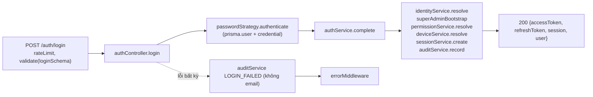
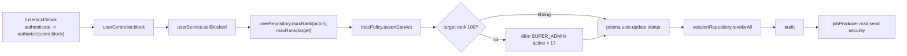
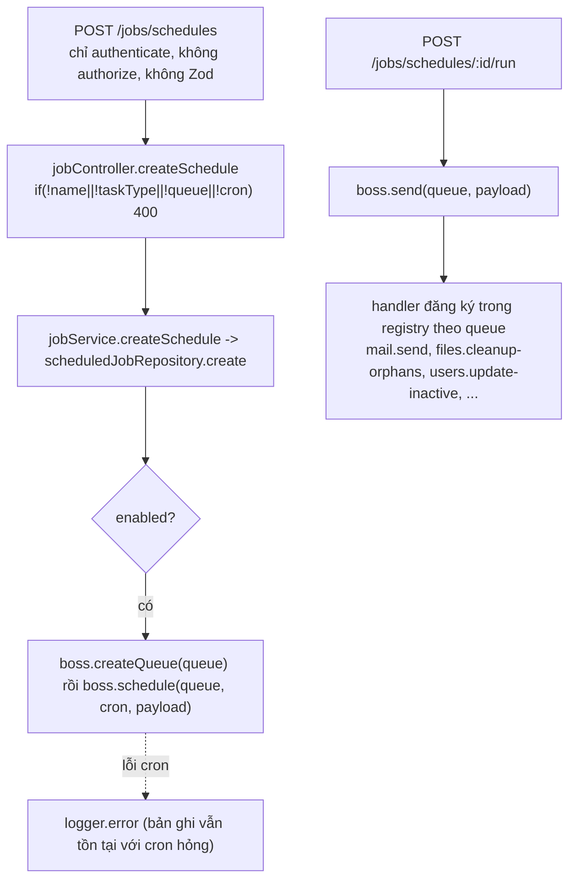
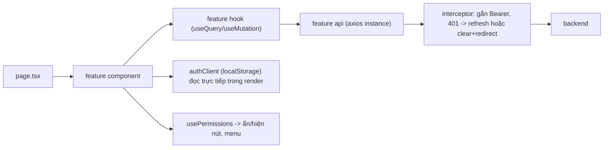

# 04. Phân tích module và luồng dữ liệu

## 1. Danh sách module backend

| Module | Trách nhiệm | Đầu vào | Đầu ra | Phụ thuộc | LOC (ước) |
| --- | --- | --- | --- | --- | --- |
| `core/database` | Prisma client singleton, helper transaction (không dùng) | — | `prisma` | generated client | 4 |
| `core/http` | `ApiError`, `success()`, `StatusCode` (không dùng) | — | — | — | 5 |
| `core/security` | argon2id, sha256, secureToken/secureOtp, JWT HS256 (jose) | secret từ env | hash/token | env | 12 |
| `core/storage` | `StorageDriver`, `LocalStorage` (chống path traversal), `R2Storage` | key, buffer | buffer | aws-sdk | 80 |
| `core/logger` | console + redact key nhạy cảm | message, data | stdout | — | 2 |
| `core/events` | `EventEmitter` (không dùng) | — | — | — | 2 |
| `config` | Zod parse env; các config nhỏ | `process.env` | object | zod | 45 |
| `middleware` | authenticate (JWT + session DB), authorize (permission set), validate (Zod body), authRateLimit, requestContext, error | req | next()/error | auth/sessions, users/rbac | 25 |
| `modules/auth` | Đăng ký, xác minh, login password/OTP/magic, reset mật khẩu, refresh, logout, sessions, bootstrap SUPER_ADMIN | body/query | tokens, user | audit, jobs, users/rbac, users/password, oauth | ~330 |
| `modules/oauth` | Google authorize/callback (PKCE), handoff code | query | redirect, tokens | auth.service, env | ~70 |
| `modules/users` | CRUD user, block/unblock, role assign/remove, tạo/sửa/xoá role, override permission, reset mật khẩu tạm, đổi mật khẩu, resolve permission | body/params | JSON | auth/sessions, audit, jobs | ~760 |
| `modules/files` | Upload dedup, list, download, soft delete, reuse, orphan stats/cleanup, import/export markdown | multipart/body | JSON/binary | core/storage, audit, jobs | ~320 |
| `modules/jobs` | pg-boss lifecycle, registry handler, CRUD lịch, trigger now, 8 handler | body/cron | JSON | files, mail, users(prisma), audit? (không) | ~470 |
| `modules/mail` | Gửi mail custom/template, lịch sử (AuditLog entityType Mail), config status, 3 mẫu DB có merge biến an toàn | body | JSON | auth/challenges, prisma | ~120 |
| `modules/audit` | `auditService.record` = `prisma.auditLog.create` | AuditInput | row | prisma | 8 |

## 2. Danh sách feature frontend

| Feature | Trách nhiệm | API dùng | Component chính | LOC |
| --- | --- | --- | --- | --- |
| `auth` | login form (RHF+Zod), must-change-password modal, api/hook | `/auth/*`, `/users/me/change-password` | `login-form.tsx`, `must-change-password-modal.tsx` | ~230 |
| `users` | list, detail, assign-role modal, role manager | `/users/*` | `user-list` 391, `user-detail` 433, `assign-role-modal` 299, `role-manager` 746 | ~1990 |
| `files` | file manager, LMS editor, previewer, converter Excel/Docs | `/files/*` | `file-manager` 1100, `lms-markdown-editor` 583, `markdown-previewer` 541, `markdown-converter` 393 | ~2700 |
| `jobs` | CRUD lịch, run now | `/jobs/*` | `jobs-manager` 740 | ~890 |
| `mail` | gửi, lịch sử, mẫu, cấu hình | `/mail/*` | `mail-manager` (1 dòng ~7KB), `template-editor` | ~40 (nén) |
| `sessions` | list/revoke | `/auth/sessions` | `session-list` (1 dòng) | ~3 (nén) |
| `lib/auth` | localStorage token store, `usePermissions` | — | — | ~100 |
| `lib/axios` | client + interceptor refresh | — | — | ~55 |
| `components/shared` | dashboard shell (sidebar theo quyền, must-change modal), avatar | `/users/me`, `/auth/logout` | `dashboard-shell` 239 | ~260 |

## 3. Luồng request, response, dữ liệu và lỗi theo từng module

### 3.1 Auth

- **Đầu vào được validate** ở mọi POST (Zod). GET `register/verify`, `magic-link/verify` lấy `req.query` ép `String()` — không validate nhưng challengeService xử lý an toàn.
- **Đầu ra**: `session` được `select` không có `refreshTokenHash` (đúng); `user` chứa `permissions` mảng.
- **Lỗi**: mọi lỗi login (kể cả `SESSION_LIMIT_REACHED`, `EMAIL_NOT_VERIFIED`) đều audit `LOGIN_FAILED`; chấp nhận được.
- **Nghiệp vụ nằm sai tầng**: `requestOtp`, `requestMagic` (controller) tự tìm user, tạo challenge, dựng URL từ `req.get("host")`, gửi job.

### 3.2 Users/RBAC

- Đúng theo flow spec (permission → rank policy → status → revoke → audit → mail).
- **Ngoại lệ**: `PATCH /users/:id` (`update`) đi thẳng `userRepository.update` không qua policy (SEC-007).
- **Đầu ra `list`**: có `total/page/limit` nhưng FE bỏ (ERR-009).
- `getPermissions` gọi `permissionService.resolve` + 2 query khác trong `Promise.all` — ổn.

### 3.3 Files

- Route: `fileRoutes.use(authenticate)` rồi **không có `authorize`** nào. Ownership được kiểm tra ở `findOwned(id, ownerId)` cho download/delete/reuse (đúng). Nhưng `GET /files/orphans/stats` và `POST /files/orphans/cleanup` là thao tác toàn hệ thống mà mọi người đều gọi được (SEC-002).
- Upload: `multer.memoryStorage()` không `limits` → kiểm tra size sau (SEC-004).
- Download: đọc toàn bộ vào Buffer rồi `res.send`; `attachment(name)` đặt Content-Disposition (an toàn với SVG).
- Import markdown: parse ở request rồi đẩy toàn bộ nội dung vào payload job; handler chỉ `normalizeMarkdown` và **không lưu gì** → tính năng "import" thực chất không tạo File. Response 202 `{accepted:true}` gây hiểu lầm. (Ghi nhận ở CODE-003/ERR-010 phụ.)
- Export markdown: đi qua `uploadService.upload` (dedup) → tạo File, đúng.

### 3.4 Jobs

- `taskType` không được kiểm tra thuộc enum → Prisma ném lỗi → 500.
- `queue` là chuỗi tự do, không ràng buộc với `taskType` → có thể đẩy payload vào `mail.send` (SEC-001).
- Handler maintenance nhận `Job[]` nhưng đọc `job.data` như object → payload luôn bị bỏ qua (ERR-004).
- `runOnServer` được lưu và hiển thị trên UI ("Server" badge) nhưng backend không đọc ở đâu.

### 3.5 Mail

- Toàn bộ nghiệp vụ ở controller (1 dòng, 3.8K ký tự). `send` gọi SMTP **đồng bộ trong request** (không qua job) → request treo theo SMTP; audit `MAIL_SENT/MAIL_FAILED` vào `AuditLog` với `entityType: "Mail"`.
- `sendTemplate kind=otp` tạo **challenge LOGIN_OTP thật** cho email nhập vào → tính năng "gửi mẫu" có tác dụng phụ nghiệp vụ (SEC-014).
- `email-template.service`: merge biến có escape HTML, kiểm tra biến hợp lệ khi lưu, `textFromHtml` tạo bản text — thiết kế tốt.
- `mailController.templates` và hai file `templates/*.template.ts` không được route tới → dead code (CODE-003).

### 3.6 Audit

- Chỉ ghi; **không có API đọc** dù seed có `audit.read`. Mail history là cách đọc duy nhất và chỉ lọc `entityType: Mail`.
- `cleanupAuditLogsJob` xoá theo `createdAt` — mặc định 90 ngày; payload bị bỏ qua (ERR-004).

## 4. Luồng dữ liệu frontend

- Lớp `usePermissions` **chỉ để trải nghiệm**, backend mới là nơi quyết định. Nhưng vì backend không authorize files/jobs, việc ẩn menu đang là "bảo mật bằng che giấu".
- `dashboard-shell` và `dashboard/page` đều gọi `/users/me` khi mount → 2 request trùng.
- `session-list` đánh dấu phần tử đầu là "Current" — không có `sessionId` hiện tại để so sánh (ERR-013).

## 5. Module quá lớn, quá phụ thuộc hoặc sai trách nhiệm

| Module/File | Vấn đề | Đề xuất |
| --- | --- | --- |
| `frontend/features/files/components/file-manager.tsx` (1100 dòng) | God component: 3 tab (một tab "upload" **không thể mở**, không có nút nào gọi `setActiveTab("upload")`), 3 modal, stats, orphan panel | Tách: `FileStats`, `OrphanPanel`, `FileTable`, `FilePreviewModal`, `DeleteFileDialog`, `ReuseFileDialog`, `UploadDropzone` |
| `role-manager.tsx` (746), `jobs-manager.tsx` (740) | Mỗi file 3 modal + bảng + form state thủ công | Tách modal thành component; form dùng RHF+Zod |
| `backend/modules/auth/auth.controller.ts` | Chứa nghiệp vụ OTP/magic request, query Prisma | Chuyển vào `otp.service.ts`/`magic-link.service.ts`; dựng URL từ config |
| `backend/modules/mail/mail.controller.ts` | Toàn bộ nghiệp vụ + Prisma + SMTP đồng bộ | Tách `mail-admin.service.ts`, `mail-history.repository.ts`; gửi qua job |
| `backend/modules/users/user.service.ts` (274 dòng, 8 use case) | Đang tiến tới God service; gọi Prisma trực tiếp | Tách `user-block.service`, `user-role.service`, `user-permission.service`; dùng repository |
| `backend/modules/jobs` | Trộn hạ tầng (pg-boss), API quản trị, handler nghiệp vụ | Tách `jobs/infra`, `jobs/api`, `jobs/handlers`; whitelist queue theo `taskType` |
| `backend/modules/files/storage/deduplicate.service.ts` | Tên không phản ánh nội dung (orphan stats + cleanup) | Đổi tên `orphan.service.ts`; thứ tự DB trước, storage sau |
| `backend/modules/users/rbac/permission.constants.ts` | Chỉ 6/26 permission; các nơi khác dùng chuỗi literal | Sinh constants từ một registry, seed từ registry |

## 6. Bảng đối chiếu endpoint và bảo vệ

| Router | authenticate | authorize | validate body | rate limit |
| --- | --- | --- | --- | --- |
| `/auth/*` public | — | — | Có (POST) | Có |
| `/auth/refresh` | — | — | Có | **Không** |
| `/auth/google` (authorize) | — | — | — | **Không** |
| `/auth/logout`, `/sessions*` | Có | — (đúng, theo chủ sở hữu) | — | — |
| `/users/*` | Có | **Có (16 route)** | Có | — |
| `/users/me`, `/users/me/change-password` | Có | — (đúng) | Có | — |
| `/files/*` | Có | **Không** | Chỉ `export-markdown` | — |
| `/mail/*` | Có | **Có (6 route)** | Có | — |
| `/jobs/*` | Có | **Không** | **Không** | — |
