# 07. Database và toàn vẹn dữ liệu

## 1. Mô hình dữ liệu

16 model trong `backend/prisma/schema.prisma`, ID dùng `cuid()` nhất quán (trừ `EmailTemplate.id` là id cố định `otp|magic-link|security-alert`, hợp lý).

```mermaid
erDiagram
  User ||--o{ AuthIdentity : "identities"
  User ||--o| PasswordCredential : "credential"
  User ||--o{ VerificationChallenge : "challenges (userId optional)"
  User ||--o{ Device : "devices"
  User ||--o{ Session : "sessions"
  Device ||--o{ Session : "sessions (SetNull)"
  User ||--o{ UserRole : "has"
  Role ||--o{ UserRole : "has"
  Role ||--o{ RolePermission : "has"
  Permission ||--o{ RolePermission : "has"
  User ||--o{ UserPermissionOverride : "has"
  Permission ||--o{ UserPermissionOverride : "has"
  User ||--o{ File : "owner (Cascade)"
  StoredObject ||--o{ File : "object (Restrict)"
  User ||--o{ AuditLog : "actor (SetNull)"

  User {
    string id PK
    string email UK
    string displayName
    string avatarUrl
    enum status "ACTIVE|BLOCKED|SUSPENDED"
    datetime emailVerifiedAt
  }
  AuthIdentity {
    string id PK
    enum provider "PASSWORD|GOOGLE|EMAIL_OTP|MAGIC_LINK"
    string providerAccountId "UK với provider"
    string providerEmail
    bool providerEmailVerified
  }
  PasswordCredential {
    string userId UK
    string passwordHash
    datetime passwordChangedAt
    bool mustChangePassword "KHÔNG có migration"
    datetime temporaryExpiresAt "KHÔNG có migration"
  }
  VerificationChallenge {
    string email
    enum type "LOGIN_OTP|MAGIC_LINK|EMAIL_VERIFY|PASSWORD_RESET"
    string tokenHash
    int attempts
    datetime expiresAt
    datetime consumedAt
  }
  Session {
    string refreshTokenHash
    datetime lastActiveAt
    datetime expiresAt
    datetime revokedAt
  }
  Role {
    string name UK
    int rank
  }
  Permission {
    string name UK
  }
  UserPermissionOverride {
    enum effect "ALLOW|DENY"
  }
  StoredObject {
    string hash UK
    string storageKey UK
    int size
    string mimeType
    int referenceCount
    datetime pendingDeleteAt
  }
  File {
    string objectId FK
    string ownerId FK
    string name
    string extension
    datetime deletedAt
  }
  AuditLog {
    string action
    string entityType
    string entityId
    json metadata
  }
  EmailTemplate {
    string id PK "otp | magic-link | security-alert"
    string subject
    string html
  }
  ScheduledJob {
    string name
    enum taskType "KHÔNG có migration"
    string queue "không unique"
    string cron
    json payload
    bool enabled
    bool runOnServer "không được đọc"
    string lastStatus
  }
```

Nhận xét thiết kế:

- **Tách `PasswordCredential` khỏi `User`**, `AuthIdentity` đa provider, `VerificationChallenge` dùng chung cho 4 loại: đúng spec và là mô hình tốt.
- **`File` (logic) / `StoredObject` (vật lý)** với `referenceCount` là mô hình dedup hợp lý; `File.object` để mặc định `onDelete: Restrict` là đúng (không xoá object khi còn File).
- **`Device`** có `fingerprint` nullable với `@@unique([userId, fingerprint])`; code luôn ghi `"anonymous"` vì FE không gửi fingerprint → thực tế mỗi user chỉ có 1 Device. Model này hiện không mang thông tin.
- **`ScheduledJob`** và **`EmailTemplate`** là hai model ngoài spec; `ScheduledJob` chưa có migration.

## 2. Quan hệ và hành vi xoá (cascade)

| Quan hệ | onDelete | Hệ quả cần biết |
| --- | --- | --- |
| `User → File` | Cascade | Xoá User sẽ xoá File **mà không giảm `StoredObject.referenceCount`** → object không bao giờ thành orphan → rò rỉ storage. Hiện chưa có API xoá user nên là **rủi ro tiềm ẩn**; nếu sau này thêm, phải xử lý bằng service, không dựa vào cascade. |
| `User → Session/Device/Identity/Credential/Challenge/UserRole/Override` | Cascade | Hợp lý |
| `Role → UserRole/RolePermission` | Cascade | `roleService.delete` xoá role tùy chỉnh → user mất vai trò im lặng (UI có cảnh báo) |
| `Permission → RolePermission/Override` | Cascade | Không có API xoá permission |
| `Device → Session` | SetNull | Hợp lý |
| `User → AuditLog.actor` | SetNull | Giữ được audit khi xoá user, đúng |
| `StoredObject → File` | Restrict (mặc định) | Đúng |

## 3. Constraint và index

| Bảng | Có | Thiếu / nhận xét |
| --- | --- | --- |
| `User` | `email` unique | Không index `status` (job inactive quét toàn bảng; chấp nhận được) |
| `AuthIdentity` | unique `(provider, providerAccountId)`, index `userId` | Tốt |
| `VerificationChallenge` | index `(email, type, createdAt)`, `expiresAt` | Tốt cho `latest()` và cleanup |
| `Session` | index `(userId, revokedAt, expiresAt)`, `expiresAt` | Tốt cho `activeCount`, `findActive` (tra theo PK) |
| `Device` | unique `(userId, fingerprint)` | Postgres coi NULL khác nhau → nhiều Device null/user (code không tạo null) |
| `Role` | `name` unique | `rank` không có check 1..100; hai role có thể trùng rank (chấp nhận được) |
| `StoredObject` | `hash` unique, `storageKey` unique, index `(referenceCount, createdAt)` | Không có `CHECK (referenceCount >= 0)` |
| `File` | index `(ownerId, deletedAt, createdAt)` | **Thiếu index `objectId`** (dùng trong `cleanupOrphans` và relation `object.files`) |
| `AuditLog` | index `createdAt`, `(actorUserId, createdAt)` | Không index `entityType` (mail history lọc `entityType: Mail` quét theo `createdAt` — chấp nhận được) |
| `ScheduledJob` | index `enabled` | `queue` không unique (ARCH-002); `name` không unique nhưng seed tìm theo name |
| `EmailTemplate` | PK | Ổn |

Kiểu dữ liệu: tất cả `DateTime` map sang `TIMESTAMP(3)` không timezone (mặc định Prisma). Ứng dụng luôn ghi UTC qua `new Date()` nên nhất quán, nhưng cần lưu ý khi truy vấn tay.

## 4. Transaction

| Nơi | Cách dùng | Đánh giá |
| --- | --- | --- |
| `super-admin-bootstrap.service.ts` | `$transaction` + `pg_advisory_xact_lock(hashtext('super-admin-bootstrap'))` + audit trong cùng tx | **Rất tốt**: serialize theo khoá, atomic với audit |
| `identity.service.ts` | `$transaction` upsert user + upsert identity | Tốt |
| `upload.service.ts` | put storage → create object (bắt conflict) → `$transaction` (refCount+1, create File) | Tốt; xử lý race hai upload cùng hash |
| `file.repository.softDelete`, `reuse` | `$transaction` | Tốt |
| `role.service.updatePermissions` | `$transaction` deleteMany + createMany | Tốt; nhưng audit ngoài tx (chấp nhận được) |
| `deduplicate.service.cleanupOrphans` | storage.delete **trước** tx | **Sai thứ tự** (ERR-005) |
| `session.service.create` | count rồi create, không tx/lock | Race vượt giới hạn (ERR-012) |
| `registration.service.register` | findUnique rồi create | Race → P2002 → 500 (ERR-012) |
| `user.service.setBlocked` | update → revokeAll → audit → mail, không tx | Nếu revokeAll lỗi, user BLOCKED nhưng session còn sống đến khi `authenticate`… thực ra `authenticate` không kiểm tra `user.status`, chỉ kiểm tra session → **user BLOCKED vẫn dùng access token 15 phút** nếu revoke thất bại. Rủi ro thấp (revoke là 1 update). |
| `challengeRepository.consume` | `updateMany where consumedAt null` → kiểm tra `count === 1` | **Tốt**: one-time-use atomic không cần tx |

## 5. Migration và seed

### 5.1 Migration

- 3 migration; migration đầu sinh bằng `prisma migrate diff` (README ghi). Hai migration sau viết tay tối giản.
- **Drift**: schema có `ScheduledJob`, `JobTaskType`, `PasswordCredential.mustChangePassword`, `temporaryExpiresAt` mà không có migration (DB-001). Tên thư mục migration dùng ngày 2026-09-15/17/18 tự đặt (không phải timestamp thực của Prisma) — chấp nhận được nhưng cho thấy migration được viết tay.
- Không có bảng `_prisma_migrations` kiểm soát trong repo (bình thường), nhưng cũng không có script kiểm tra drift trong CI.

### 5.2 Seed (`prisma/seed.ts`)

- Idempotent bằng `upsert` cho role, permission, role-permission; `ScheduledJob` tìm theo `name` rồi tạo nếu chưa có.
- Phân quyền seed: SUPER_ADMIN tất cả; ADMIN tất cả trừ `*promote*`; MEMBER 4 quyền. **Không có** quyền `files.delete` cho MEMBER dù UI/API cho phép xoá file của mình (vì API không kiểm tra).
- Bootstrap legacy bằng `BOOTSTRAP_ADMIN_EMAIL/PASSWORD`: mỗi lần chạy seed sẽ **ghi đè lại passwordHash** (`update:{passwordHash:hash,…}`) — chạy seed ở production sau khi admin đã đổi mật khẩu sẽ reset về mật khẩu env. Nên chỉ `create`, không `update`.
- Seed dùng `PrismaClient` từ `src/generated` → phải `db:generate` trước (README có ghi).
- `main().finally(disconnect)` không `catch` → lỗi seed vẫn thoát mã ≠0 (Node 22 unhandled rejection) nhưng không có message rõ.

## 6. Nguy cơ mất, trùng hoặc sai lệch dữ liệu

| Nguy cơ | Cơ chế | Mức | Mã |
| --- | --- | --- | --- |
| Schema thật ≠ Prisma client | Migration thiếu | Critical | DB-001 |
| `StoredObject` tồn tại nhưng file vật lý mất | Cleanup xoá storage trước DB; upload/reuse xen giữa | Medium | ERR-005 |
| `referenceCount` lệch | Cascade xoá User qua File; lỗi giữa `storage.put` và tx (object được tạo với refCount 0 → thành orphan hợp lệ, OK) | Tiềm ẩn | DB-002 |
| Orphan bị xoá sớm hơn 10 ngày | `POST /files/orphans/cleanup {force}` mở cho mọi user | High | SEC-002 |
| Mật khẩu admin bị reset khi chạy lại seed | `upsert update passwordHash` | Medium (vận hành) | (ghi ở đây) |
| Audit bị xoá bởi người không có quyền | Jobs API mở | Critical | SEC-001 |
| Lịch job ghi đè nhau | `queue` không unique | Medium | ARCH-002 |
| Session không bao giờ hết hạn | Sliding expiry | Low | DB-004 |
| Dữ liệu test xoá nhầm | `deleteMany()` toàn bảng | Low | DB-003 |
| Challenge cũ tồn đọng | Job `auth.cleanup-challenges` mỗi giờ xoá expired/consumed | Đã xử lý | — |
| Session hết hạn tồn đọng | Job `sessions.cleanup-expired` hard delete | Đã xử lý; lưu ý mất lịch sử phiên | — |
| `AuditLog.metadata` chứa email người nhận mail (PII) | `mail.controller` ghi `to`, `subject` | Low | (cân nhắc retention) |

## 7. Truy vấn dữ liệu đáng chú ý

- `permissionService.resolve`: 2 query, include lồng 2 cấp — dữ liệu nhỏ, ổn.
- `userRepository.maxRank`: `findFirst orderBy role.rank desc` — ổn; được gọi 2–3 lần mỗi thao tác admin (actor, target) trong `Promise.all` — ổn.
- `mailController.list`: `findMany where entityType Mail orderBy createdAt take limit` + `count` — ổn với index `createdAt`, nhưng khi AuditLog lớn, `count` toàn bảng theo `entityType` không index sẽ chậm dần.
- `updateInactiveUsersJob`: `user.findMany where status ACTIVE AND sessions none lastActiveAt >= cutoff AND createdAt < cutoff` → subquery anti-join; chấp nhận được.
- `fileRepository.list`: không phân trang; user có hàng nghìn file sẽ nặng (Low).

## 8. Khuyến nghị cho database

1. Sinh migration bù ngay (DB-001); thêm CI drift check.
2. `@@index([objectId])` cho `File`; `@unique` cho `ScheduledJob.queue` (hoặc đổi cách khoá lịch).
3. Migration SQL thủ công thêm `CHECK ("referenceCount" >= 0)` và `CHECK ("rank" BETWEEN 1 AND 100)`.
4. Seed: bootstrap admin chỉ `create`; tách seed dữ liệu tham chiếu (roles/permissions) khỏi seed môi trường (admin, jobs).
5. Quyết định chính sách: absolute session lifetime; retention AuditLog và pg-boss archive; xử lý xoá user (soft delete + giảm refCount).
