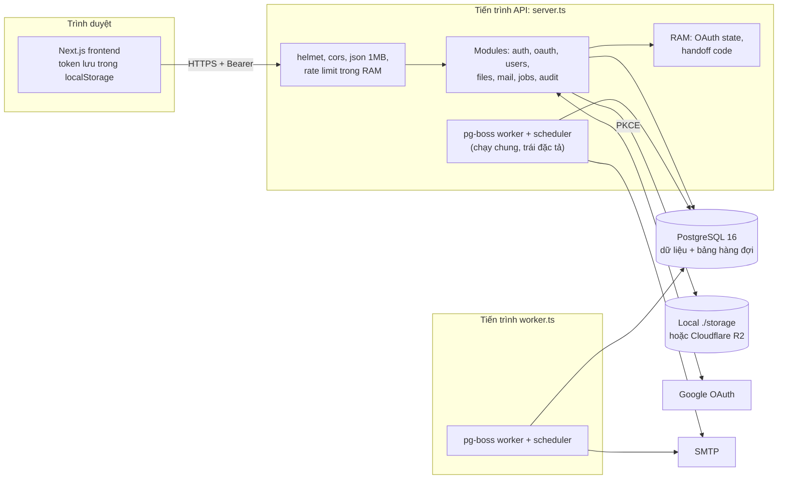
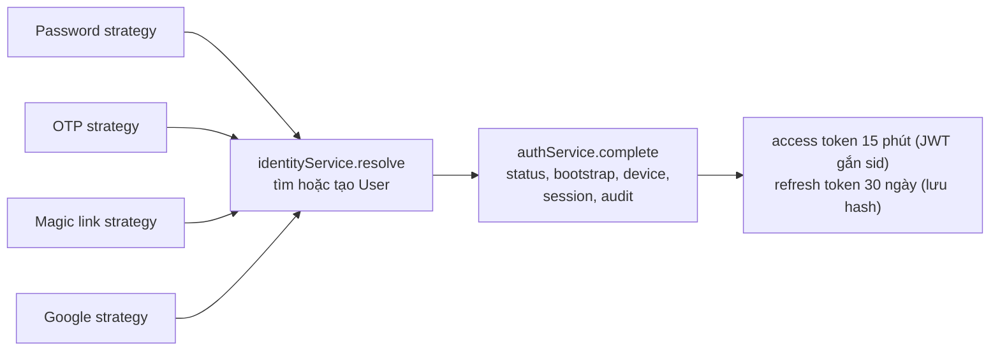

# 01. Tổng quan và kiến trúc

> **Tài liệu lịch sử:** file này review phiên bản source cũ đã được xóa để viết lại. Không dùng làm kiến trúc triển khai hiện tại. Kiến trúc mới, tối giản để tự code tay nằm tại [`docs/01-KIEN-TRUC-CODE-BASE.md`](../docs/01-KIEN-TRUC-CODE-BASE.md).

## 1. Dự án là gì

**CoreStack** là một _fullstack base_ (nền tảng dùng lại cho nhiều sản phẩm sau), xây theo đặc tả `CODEX_PROJECT_SETUP.md`. Tiến độ được theo dõi bằng checklist trong `README.md` để mentor review. Dự án gồm hai ứng dụng **độc lập**, không phải monorepo workspace:

| Thành phần    | Công nghệ                                                                                   | Vị trí                                 |
| ------------- | ------------------------------------------------------------------------------------------- | -------------------------------------- |
| Frontend      | Next.js 15 (App Router), React 19, TanStack Query, Axios, React Hook Form + Zod, Tailwind 4 | `frontend/`                            |
| Backend       | Express 5 (ESM), TypeScript, Prisma 6, Zod, jose (JWT), argon2, multer, nodemailer          | `backend/`                             |
| Hàng đợi/lịch | pg-boss 12, dùng chính PostgreSQL                                                           | `backend/src/modules/jobs`             |
| Database      | PostgreSQL 16 (Docker Compose)                                                              | `docker-compose.yml`, `backend/prisma` |
| Lưu trữ file  | Local disk hoặc Cloudflare R2 (S3 API)                                                      | `backend/src/core/storage`             |
| Dịch vụ ngoài | Google OAuth2, SMTP, Cloudflare R2                                                          |                                        |

## 2. Actor và chức năng

| Actor                  | Mô tả                                               | Làm được gì                                                                                                             |
| ---------------------- | --------------------------------------------------- | ----------------------------------------------------------------------------------------------------------------------- |
| Khách                  | Chưa đăng nhập                                      | Đăng ký email/mật khẩu, xác minh email, đăng nhập mật khẩu/Google, quên mật khẩu. API OTP/magic link vẫn mở dù UI đã gỡ |
| User mới               | Vừa đăng ký, **chưa có role nào** (rank 0, ERR-007) | Theo thiết kế thì không có quyền; thực tế vẫn gọi được Files và Jobs API (SEC-001/002)                                  |
| MEMBER (rank 10)       | Người dùng thường                                   | Files, xem/thu hồi phiên của mình                                                                                       |
| ADMIN (rank 50)        | Quản trị                                            | Users, roles, mail, jobs (trên UI)                                                                                      |
| SUPER_ADMIN (rank 100) | Duy nhất một người                                  | Toàn quyền; được bootstrap qua Google hoặc qua seed                                                                     |
| Worker                 | Tiến trình pg-boss                                  | Gửi mail, dọn challenge/session/orphan/audit, cập nhật user không hoạt động                                             |

## 3. Mức độ hoàn thiện theo module

| Module                                     | Backend                           | Frontend           | Test                   | Nhận xét ngắn                                    |
| ------------------------------------------ | --------------------------------- | ------------------ | ---------------------- | ------------------------------------------------ |
| Đăng ký, đăng nhập mật khẩu, quên mật khẩu | Đủ                                | Đủ                 | Integration            | Pipeline tốt; ERR-002, ERR-006, ERR-017, SEC-017 |
| OTP / Magic Link                           | Đủ                                | Đã gỡ (chủ ý)      | Integration            | Lệch đặc tả mục 32 (ARCH-004)                    |
| Google OAuth2                              | Đủ (PKCE)                         | Đủ                 | Integration (identity) | SEC-017, SEC-005                                 |
| Session / Device                           | Đủ                                | Đủ                 | Integration            | ERR-003, ERR-013, ERR-018                        |
| Users / RBAC                               | Đủ, có policy riêng               | Đủ (component lớn) | Unit (mock)            | SEC-015, SEC-007, ERR-009                        |
| Mail + template                            | Đủ                                | Đủ                 | Unit                   | ERR-001 (PUT), SEC-014                           |
| Jobs / lịch                                | Đủ tính năng                      | Đủ                 | Unit (mock)            | **SEC-001 Critical**, ERR-004, ARCH-002          |
| Files / dedup / orphan                     | Đủ                                | Đủ (1.100 dòng)    | Unit + integration     | SEC-002, SEC-004, ERR-005, ERR-020               |
| Markdown import/export                     | Export đủ; import là stub         | Xử lý ở client     | Unit                   | ERR-022                                          |
| Audit                                      | Đủ cho auth/users/files           | —                  | Gián tiếp              | Chưa audit jobs/mail template/cleanup            |
| Docs, Docker                               | Có, ngắn (14 file docs, 107 dòng) | Có                 | —                      | DOC-001, OPS-001, OPS-002                        |

Nhìn chung, **độ phủ tính năng rộng và gần đạt đặc tả**. Chỗ còn thiếu là độ sâu: phân quyền cho các module mới, quy trình migration, và tính nhất quán giữa các luồng.

## 4. Kiến trúc hiện tại

### 4.1 Sơ đồ thành phần

### 4.2 Kiểu kiến trúc

**Modular monolith** phân tầng: `routes → controller → service → repository → Prisma`, chia theo module nghiệp vụ (`modules/auth`, `users`, `files`, `mail`, `jobs`, `oauth`, `audit`), phần dùng chung đặt ở `core/` (database, http, security, storage, logger) và `middleware/`. Frontend chia theo feature (`features/<tên>/{api,hooks,components,types}`), dùng TanStack Query cho dữ liệu server.

Với quy mô một base project do một người phát triển, **đây là lựa chọn đúng**. Không cần microservices, message broker riêng hay CQRS. Dùng PostgreSQL cho cả dữ liệu lẫn hàng đợi (pg-boss) giúp vận hành đơn giản.

### 4.3 Luồng xác thực chung

Đây là **điểm thiết kế tốt nhất** của dự án. Mọi phương thức đăng nhập chỉ cần trả về một `StrategyResult`, còn việc tạo session, kiểm tra trạng thái và ghi audit nằm ở một chỗ duy nhất. Thêm một provider mới (GitHub, Microsoft) sẽ rất rẻ. Chính vì mọi luồng hội tụ vào `identityService.resolve`, nên một lỗi ở đây (SEC-017) cũng ảnh hưởng mọi luồng. Đây là chỗ cần được test kỹ nhất.

### 4.4 Luồng dữ liệu end-to-end tiêu biểu

**Upload file**:

1. `POST /files/upload` → `authenticate` (kiểm tra JWT, rồi kiểm tra session trong DB).
2. multer đọc toàn bộ file vào RAM, sau đó `fileService.upload` kiểm tra size/MIME.
3. `uploadService` tính SHA-256. Nếu hash chưa có thì ghi storage và tạo `StoredObject`, xử lý race bằng unique `hash`.
4. Transaction: tăng `referenceCount` và tạo bản ghi `File`.

**Xóa file**: `softDelete` giảm `referenceCount` và đặt `pendingDeleteAt`. Job hằng ngày `files.cleanup-orphans` sau đó xóa storage rồi xóa bản ghi. Thiết kế dedup theo nội dung là tốt; các điểm yếu nằm ở khâu xóa (ERR-005, ERR-020, DB-005).

**Gửi email**: service gọi `jobProducer.send("mail.send", payload)` → pg-boss lưu vào PostgreSQL → worker `mailSendJob` render template → SMTP. API không gọi SMTP trực tiếp từ business service, đúng đặc tả mục 40. Tuy vậy, `mail.controller.ts` (`send`, `sendTemplate`) lại gửi SMTP đồng bộ trong request.

### 4.5 Điểm hợp lý

- Phân tầng rõ ở phần lớn module; repository tách khỏi service ở auth, files, jobs.
- Storage có interface chung (`StorageDriver`), với hai implementation Local và R2. R2 có unit test với client giả, nên đổi nơi lưu trữ không phải sửa nghiệp vụ.
- RBAC policy (`rbac.policy.ts`) tách khỏi service và có test riêng.
- Định dạng response thống nhất (`success(data, meta)`, lỗi `{ success: false, error: { code, message, details } }`).
- Env được validate bằng Zod lúc khởi động.
- Frontend có query key factory và tách `api`/`hooks`/`components` theo feature.

### 4.6 Điểm chưa hợp lý

| Điểm                                             | Vì sao chưa hợp lý                                                                                                                                    | Mã       |
| ------------------------------------------------ | ----------------------------------------------------------------------------------------------------------------------------------------------------- | -------- |
| `server.ts` khởi động worker và scheduler        | Đặc tả mục 22 ghi "`server.ts` chỉ HTTP API". Chạy cả `server` lẫn `worker` thì có 2 nhóm worker cùng xử lý; scale API lên N bản thì có N nhóm worker | ARCH-002 |
| Trạng thái quan trọng nằm trong RAM              | OAuth state, handoff code, rate limit mất khi restart và không dùng chung được giữa nhiều instance                                                    | ARCH-001 |
| Permission là "danh sách", không phải "hợp đồng" | 20/26 permission không route nào kiểm tra. Phân quyền thực tế nằm ở UI                                                                                | ARCH-003 |
| Rank vừa là thứ bậc vừa là tập quyền             | Role rank cao tự nhận quyền của mọi role thấp hơn, kể cả role tùy chỉnh không liên quan                                                               | SEC-015  |
| Lịch jobs dùng tên queue làm khóa                | Nhiều bản ghi `ScheduledJob` cùng queue sẽ ghi đè lịch của nhau trong pg-boss                                                                         | ARCH-002 |
| Controller gọi Prisma, page gọi axios            | Trái hướng phụ thuộc mà chính đặc tả đặt ra                                                                                                           | CODE-006 |

### 4.7 Điểm nghẽn và điểm lỗi đơn

| Điểm                                     | Nhận định                                                                                                                                     |
| ---------------------------------------- | --------------------------------------------------------------------------------------------------------------------------------------------- |
| PostgreSQL                               | Là điểm lỗi đơn cho mọi thứ (dữ liệu, hàng đợi, session). Chấp nhận được ở quy mô này, với điều kiện có backup và health check thật (OPS-004) |
| Tiến trình API                           | Hiện chỉ chạy được 1 instance (ARCH-001). Khi chết thì mất luôn OAuth state và handoff đang chờ                                               |
| RAM khi upload/download                  | Buffer toàn bộ file (SEC-004, PERF-002). Vài request lớn đồng thời có thể làm sập API                                                         |
| Rate limit theo IP                       | Sau proxy, cấu hình sai sẽ gộp mọi người vào một IP (OPS-003)                                                                                 |
| Mỗi request có `authorize` tốn ≥ 3 query | Chưa phải nghẽn ở quy mô hiện tại (PERF-001)                                                                                                  |

## 5. Điểm mạnh và hạn chế tổng quát

**Điểm mạnh**

1. Hiểu và áp dụng đúng nhiều nguyên tắc bảo mật khó: hash mọi secret, rotation, JWT gắn session, PKCE, tiêu thụ nguyên tử, advisory lock.
2. Kiến trúc module rõ, pipeline xác thực hội tụ, storage trừu tượng hóa.
3. Có test integration trên DB thật cho các luồng auth quan trọng.
4. Độ phủ tính năng rộng, UI tiếng Việt khá chau chuốt.
5. Có quy trình làm việc với AI agent được ghi thành văn bản (`AGENTS.md`, skill `roadmap-checklist`).

**Hạn chế**

1. Phân quyền server bị bỏ trống ở Jobs/Files. Đây là lỗ hổng nghiêm trọng nhất.
2. Ranh giới tin cậy giữa các luồng đăng nhập chưa được nghĩ kỹ (SEC-017).
3. Quy trình migration và CI chưa có, nên "chạy trên máy tôi" không đồng nghĩa với "chạy được khi triển khai".
4. Chất lượng code không đồng đều: code nén, component quá lớn, dead code.
5. Checklist README không phản ánh đúng thực tế và chưa được sửa sau review v1.
