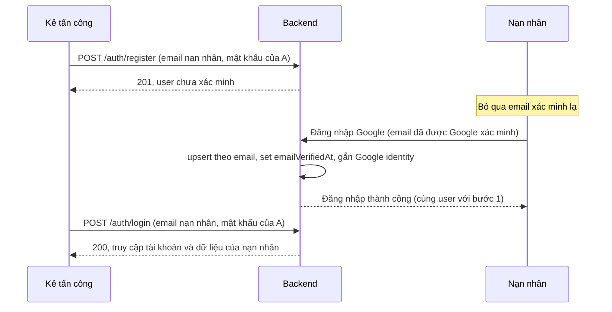
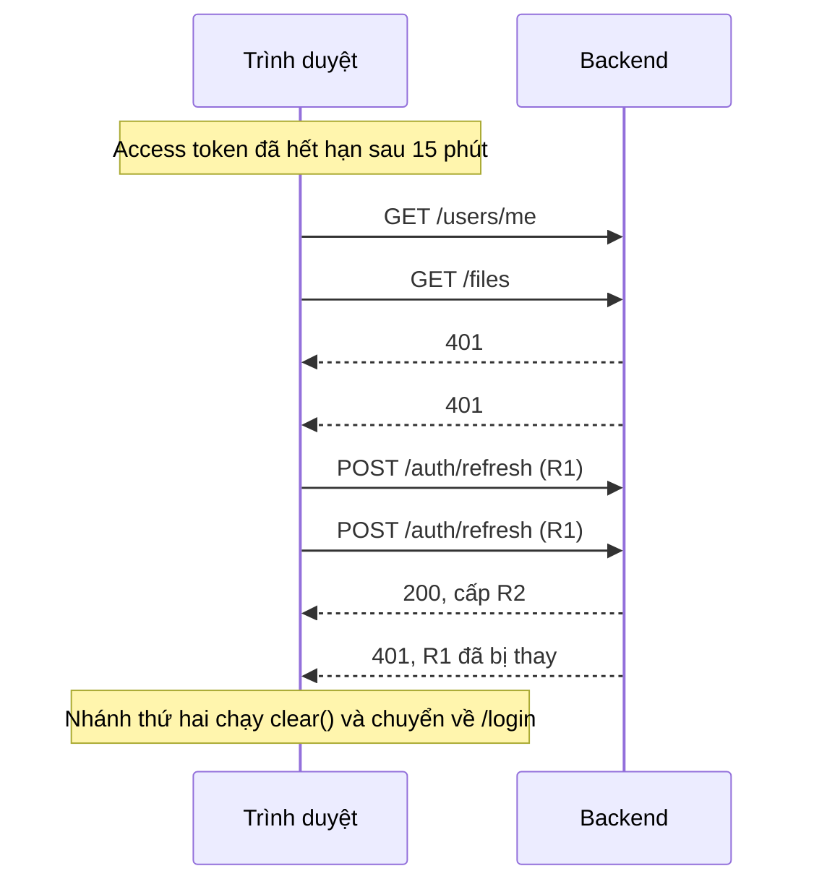

# 02. Vấn đề và rủi ro

> Danh sách đầy đủ 63 vấn đề, sắp theo mức độ. Mã vấn đề giữ nguyên như báo cáo v1 để học viên theo dõi tiến độ; vấn đề mới ở v2 được đánh số tiếp.

## 1. Quy ước

**Nhóm mã**: `SEC` bảo mật/phân quyền · `ERR` lỗi logic/runtime/nghiệp vụ · `DB` dữ liệu/migration · `ARCH` kiến trúc · `CODE` chất lượng code · `OPS` triển khai/vận hành · `TEST` kiểm thử · `DOC` tài liệu · `PERF` hiệu năng.

**Kết luận**:

- **Xác nhận**: có bằng chứng trực tiếp trong code; đọc code là đủ kết luận.
- **Tiềm ẩn**: logic cho thấy có thể xảy ra (thường là race condition hoặc phụ thuộc hạ tầng), chưa tái hiện vì không có môi trường chạy.
- **Chưa đủ DL**: cần chạy lệnh/môi trường thật mới kết luận được.

**v1→v2**: `Còn` = vấn đề v1 vẫn nguyên; `Mới` = phát hiện ở v2; có ghi chú nếu điều chỉnh mức độ hoặc phạm vi.

Nhiều file backend bị nén thành 1–3 dòng (CODE-001), nên số dòng ở những file đó không có ý nghĩa. Với các file này, báo cáo chỉ vị trí bằng **tên hàm/biến** (ví dụ `auth.controller.ts` → `requestMagic`).

## 2. Bảng tổng hợp

| Mã | Mức độ | Nhóm | Vị trí | Vấn đề | Ảnh hưởng | Hướng xử lý | Kết luận | v1→v2 |
| --- | --- | --- | --- | --- | --- | --- | --- | --- |
| SEC-001 | Critical | Phân quyền | `backend/src/modules/jobs/job.routes.ts:7-15`; `job.controller.ts:84,109` | Jobs API chỉ `authenticate`, không `authorize`; client tự chọn `queue`, `cron`, `payload`; `updateSchedule` ghi thẳng `req.body` | Ai tự đăng ký tài khoản cũng gửi được mail tùy ý qua SMTP hệ thống, chạy job khóa user/xóa audit, tắt lịch hệ thống | `authorize(jobs.*)`; Zod; server tự ánh xạ `taskType → queue`; cấm lập lịch `mail.send` | Xác nhận | Còn |
| DB-001 | Critical | Migration | `backend/prisma/schema.prisma` vs `backend/prisma/migrations/` | `ScheduledJob`, `JobTaskType`, `mustChangePassword`, `temporaryExpiresAt` không có migration (thêm ở commit `5091d83`) | DB tạo bằng `migrate deploy` thiếu bảng/cột → seed lỗi, login lỗi 500 | Sinh migration bù, review SQL, commit; CI kiểm tra drift | Xác nhận | Còn |
| SEC-002 | High | Phân quyền | `files/file.routes.ts:5-14`; `file.controller.ts` (`cleanupOrphans`) | Files API không `authorize`; `POST /files/orphans/cleanup {force:true}` mở cho mọi user | Xóa vật lý toàn bộ orphan, bỏ qua retention; lộ thống kê hệ thống | `authorize(files.*)`; cleanup/stats chỉ cho quản trị | Xác nhận | Còn |
| SEC-003 | High | Xác thực | `auth/auth.controller.ts` (`register`, `requestMagic`) | Link xác minh email và magic link dựng từ `req.get("host")` | Host header poisoning → nạn nhân nhận email thật chứa link về domain kẻ tấn công → lộ token | Dùng env `API_PUBLIC_URL` bắt buộc | Xác nhận (khai thác phụ thuộc reverse proxy) | Còn |
| SEC-004 | High | DoS | `files/file.routes.ts:3`; `file.service.ts` (`upload`) | multer `memoryStorage()` không `limits`; kiểm tra size sau khi đã buffer | Upload vài GB làm cạn RAM tiến trình API | `limits:{fileSize, files:1}`; map `MulterError` → 413 | Xác nhận | Còn |
| SEC-017 | High | Xác thực | `auth/identities/identity.service.ts` (`resolve`, nhánh `upsert`); `tests/integration/google-identity-sync.test.ts:31-38` | Google login gắn vào user có sẵn theo email **kể cả khi user đó chưa xác minh**, set `emailVerifiedAt`, giữ nguyên mật khẩu do người đăng ký trước đặt | Pre-account takeover: kẻ tấn công đăng ký trước bằng email nạn nhân rồi đăng nhập bằng mật khẩu của mình sau khi nạn nhân login Google; nếu email thuộc `SUPER_ADMIN_GOOGLE_EMAILS` thì chiếm luôn SUPER_ADMIN | Khi liên kết vào tài khoản chưa xác minh: xóa `passwordCredential`, thu hồi session; sửa test | Xác nhận | Mới |
| ERR-001 | High | Runtime | `backend/src/app.ts` (`cors methods`); `user.routes.ts:19`; `mail.routes.ts` (`put /templates/:id`) | CORS chỉ cho `GET,POST,PATCH,DELETE`; 2 route dùng `PUT` | Trình duyệt chặn preflight → không lưu được quyền của vai trò và mẫu email (kể cả dev `:3000`→`:4000`) | Thêm `PUT` hoặc đổi route sang `PATCH` | Xác nhận (cơ chế CORS; chưa chạy trình duyệt) | Còn |
| ERR-002 | High | Frontend | `frontend/src/lib/axios/interceptors.ts:17-30` | Mọi 401 (sai mật khẩu, OTP sai, exchange lỗi) → `clear()` + `location.assign("/login")` | Sai mật khẩu → trang reload, không thấy lỗi; các thông báo lỗi 401 đã viết sẵn không bao giờ hiện | Chỉ refresh/redirect khi request có Bearer và không phải route `/auth/*` công khai | Xác nhận | Còn |
| ERR-003 | High | Race | `interceptors.ts:17-30`; `auth/sessions/session.service.ts` (`refresh`) | Không gộp refresh; nhiều 401 song song gọi nhiều refresh cùng token; backend so sánh rồi cập nhật không nguyên tử | Sau 15 phút, trang có nhiều query → bị logout ngẫu nhiên | Một promise refresh dùng chung; backend update có điều kiện | Tiềm ẩn (khả năng cao) | Còn |
| SEC-005 | Medium | DoS/bộ nhớ | `oauth/google/google-oauth.strategy.ts:7,12`; `google-oauth.routes.ts:8` | Map `states` chỉ xóa khi callback; `GET /auth/google` không rate limit | Gọi liên tục làm Map phình dần | Prune theo TTL, giới hạn kích thước, rate limit | Xác nhận | Còn, **hạ từ High** |
| SEC-006 | Medium | Cấu hình | `backend/src/config/env.ts:6` | `ACCESS_TOKEN_SECRET`, `DATABASE_URL` có giá trị mặc định công khai | Production quên đặt biến vẫn chạy với secret ai cũng biết | Fail-fast khi `NODE_ENV=production` thiếu biến | Xác nhận | Còn, **hạ từ High** |
| SEC-007 | Medium | Phân quyền | `users/user.service.ts:25`; `user.routes.ts:27` | `PATCH /users/:id` không qua `rbacPolicy` | ADMIN sửa được hồ sơ SUPER_ADMIN/ADMIN khác | Gọi `assertCanAct` (trừ tự sửa) | Xác nhận | Còn |
| SEC-008 | Medium | Lộ dữ liệu | `auth.controller.ts` (`requestOtp`, `requestMagic`); `password-reset.service.ts`; `user.service.ts:170` | OTP, token magic link, mật khẩu tạm nằm plaintext trong payload job pg-boss | Ai đọc được DB/backup thấy secret còn hiệu lực | Job chỉ nhận id; hoặc mã hóa payload; rút ngắn archive | Xác nhận | Còn |
| SEC-009 | Medium | Dependency | `frontend/package.json` (`xlsx ^0.18.5`); `markdown-converter.ts:59` | `xlsx` bản npm 0.18.5 không còn được vá (CVE-2023-30533, CVE-2024-22363) | Parse file Excel người dùng chọn → prototype pollution/ReDoS phía client | Dùng SheetJS chính thức ≥ 0.20.2 hoặc thư viện khác | Xác nhận (phiên bản) | Còn |
| SEC-015 | Medium | Phân quyền | `users/rbac/permission.service.ts:26`; `rbac/role.service.ts:35-55, 78-100` | Kế thừa quyền của mọi role có rank ≤ rank của user + tạo/sửa role không kiểm tra `permissionIds` ⊆ quyền của actor | ADMIN tự cấp cho mình bất kỳ permission nào bằng cách thêm vào role rank thấp hơn | Chỉ cho cấp permission actor đang có; cân nhắc bỏ kế thừa theo rank | Xác nhận (tác động hiện tại hạn chế) | Mới |
| ERR-004 | Medium | Runtime | `jobs/job.registry.ts:24,28` | Handler pg-boss v12 nhận mảng `Job[]`, code lại kiểm tra `"data" in job` trên mảng | Payload (`retentionDays`, `inactiveDays`, `targetStatus`) luôn bị bỏ qua | Lặp `for (const job of jobs)` như `mail-send.job.ts` | Xác nhận code (hành vi thư viện theo tài liệu pg-boss ≥ 10) | Còn |
| ERR-005 | Medium | Race/toàn vẹn | `files/storage/deduplicate.service.ts:48-55` | Xóa file vật lý trước transaction DB | Upload cùng nội dung xen giữa → `StoredObject` còn, file vật lý mất → download 500 | Khóa/xóa bản ghi DB trước, xóa storage sau | Tiềm ẩn | Còn |
| ERR-006 | Medium | Nghiệp vụ | `auth/registration.service.ts`; `identity.service.ts`; `password.strategy.ts` | Không có API gửi lại email xác minh; đăng ký lại → 409; OTP/magic link không set `emailVerifiedAt` | Không xác minh kịp trong 20 phút → tài khoản kẹt vĩnh viễn | API resend; cho đăng ký lại khi chưa xác minh | Xác nhận | Còn |
| ERR-007 | Medium | Nghiệp vụ | `registration.service.ts`; `identity.service.ts` | User mới không được gán role MEMBER | Rank 0, không có quyền nào, nhưng vẫn gọi được Files/Jobs (SEC-001/002) | Gán MEMBER trong transaction tạo user | Xác nhận | Còn |
| ERR-008 | Medium | Runtime | `jobs/job.service.ts:12` | `started ??= boss.start()` cache cả promise bị reject | Khởi động lúc DB chưa sẵn sàng → mọi `send()` lỗi đến khi restart | Reset `started` khi lỗi; retry có backoff | Xác nhận | Còn |
| ERR-009 | Medium | Frontend | `features/users/api/users.api.ts:7` | Bỏ `total/page`, không phân trang | Chỉ thấy 20 user đầu | Truyền page/limit, hiển thị tổng, phân trang | Xác nhận | Còn |
| ERR-010 | Medium | Validation | `jobs/job.controller.ts:84,109` | Không có Zod; `taskType`, `cron` không kiểm tra; `updateSchedule` truyền nguyên `req.body` (mass assignment `lastStatus`, `lastRunAt`…) | 500 khi dữ liệu sai; cron hỏng vẫn lưu; ghi đè trường hệ thống | Zod schema + whitelist trường | Xác nhận | Còn (bổ sung mass assignment) |
| ERR-011 | Medium | Nghiệp vụ | `identity.service.ts:13` | Mỗi lần Google login ghi đè `displayName`, `avatarUrl` | Mất tên do user/admin đã sửa | Chỉ điền khi đang trống | Xác nhận | Còn |
| ERR-017 | Medium | Nghiệp vụ | `auth/password-reset.service.ts:25` | "Quên mật khẩu" không xóa `mustChangePassword`/`temporaryExpiresAt` (trong khi `password.service.ts` có xóa) | Sau khi mật khẩu tạm hết hạn, user tự đặt lại mật khẩu vẫn bị `TEMPORARY_PASSWORD_EXPIRED` | Xóa 2 trường trong `confirm`; thêm test | Xác nhận | Mới |
| ERR-018 | Medium | Thiết kế | `auth/sessions/session.service.ts` (`create`); đặc tả mục 16 | Chạm giới hạn 5 session thì không có đường tự gỡ khi chưa đăng nhập được; session bị bỏ rơi vẫn tính | Tài khoản chỉ dùng Google bị khóa tới 30 ngày | Cho "thu hồi phiên khác" sau khi đã xác thực; bỏ qua session lâu không hoạt động | Tiềm ẩn (đúng đặc tả, thiếu luồng phục hồi) | Mới |
| ERR-020 | Medium | Race/toàn vẹn | `files/file.service.ts` (`remove`); `file.repository.ts:17-26` | `softDelete` cập nhật `where:{id}` không kiểm tra `deletedAt` → 2 request xóa đồng thời trừ `referenceCount` 2 lần | Object bị coi là orphan dù file khác còn dùng → cleanup xóa mất file vật lý | `updateMany where {id, deletedAt:null}`, chỉ trừ khi `count===1`; CHECK `>= 0` | Tiềm ẩn | Mới |
| ARCH-001 | Medium | Mở rộng | `oauth/oauth-handoff.service.ts`; `google-oauth.strategy.ts:7`; `middleware/rate-limit.middleware.ts` | OAuth state, handoff code, bộ đếm rate limit lưu trong RAM | Chỉ chạy được 1 instance; restart mất state | Lưu DB hoặc store dùng chung | Xác nhận | Còn |
| ARCH-002 | Medium | Thiết kế | `server.ts:14-15`; `jobs/job.service.ts:54,135,156`; `schema.prisma` (`ScheduledJob`) | `server.ts` chạy worker + scheduler (trái đặc tả mục 22); khóa lịch pg-boss = tên queue; `runOnServer` không được dùng | Hai tiến trình cùng xử lý job; nhiều lịch cùng queue ghi đè/tắt lẫn nhau | Tách worker; khóa lịch theo `id`; bỏ `runOnServer` | Xác nhận | Còn |
| ARCH-003 | Medium | Phân quyền | `prisma/seed.ts:5-11`; `rbac/permission.constants.ts`; `*.routes.ts` | Seed 26 permission nhưng backend chỉ enforce 6 | 20 permission chỉ ẩn/hiện menu; đây là gốc rễ của SEC-001/002 | Mỗi permission phải có route/policy dùng nó; test "mọi route ghi đều có authorize" | Xác nhận | Mới |
| OPS-001 | Medium | Docker | `frontend/Dockerfile`; `frontend/.dockerignore` | Không `ARG NEXT_PUBLIC_API_URL`; `.env*` bị ignore; không copy `next.config.ts` sang runtime | Image trỏ `localhost:4000`; `images.remotePatterns` có thể mất | ARG/ENV lúc build; `output: "standalone"` | Xác nhận (Dockerfile) / Chưa đủ DL (runtime) | Còn |
| OPS-002 | Medium | Triển khai | `backend/Dockerfile`; `docker-compose.yml` | `pnpm prune --prod` bỏ `prisma` CLI; không có bước migrate; storage local không có volume | Không migrate được từ image; file mất khi redeploy | Bước migrate riêng; volume; dùng R2 ở production | Xác nhận | Còn |
| OPS-003 | Medium | Vận hành | `backend/.env.example` (`TRUST_PROXY=false`); `rate-limit.middleware.ts` | Chạy sau reverse proxy mà quên bật trust proxy → mọi request chung 1 IP | 10 request auth/15 phút cho toàn site | Tài liệu hóa; cảnh báo khi thấy `X-Forwarded-For` | Tiềm ẩn | Còn |
| CODE-001 | Medium | Chất lượng | 59/190 file TS/TSX; 5 file > 500 dòng (`file-manager.tsx` 1.100 dòng) | Code nén thành 1–3 dòng (tới 3.869 ký tự/dòng); component khổng lồ | Không review/diff được; vi phạm hard limit 500 dòng (đặc tả mục 40) | Prettier + lint-staged; tách component | Xác nhận | Còn (cập nhật số liệu) |
| CODE-002 | Medium | Trùng lặp | `prisma/seed.ts`; `permission.constants.ts`; `role-manager.tsx`; `dashboard-shell.tsx` | Catalog permission lặp nhiều nơi; FE dùng `users.roles.read` mà backend không kiểm tra | UI và API lệch nhau | Một nguồn constants duy nhất cho seed + FE | Xác nhận | Còn |
| CODE-003 | Medium | Dead code | `TemplateGallery`, `mailController.templates`, `mail/templates/*`, `app/(auth)/otp/page.tsx`, `core/events/*`, `core/database/transaction.ts`, `components/ui/button.tsx`, `shared/loading.tsx`, `MarkdownImporter`, 4 schema | Code không được gọi | Gây hiểu nhầm, tăng chi phí bảo trì | Xóa hoặc nối lại | Xác nhận | Còn |
| TEST-001 | Medium | Kiểm thử | `backend/tests/**`; FE chỉ 2 file test | Không test authorize theo route, Jobs/Files API, interceptor, refresh race, liên kết Google an toàn | SEC-001/002/017, ERR-001/002 lọt qua "test pass" | Test ma trận phân quyền theo route; test interceptor | Xác nhận | Còn |
| DB-002 | Medium | Index/constraint | `schema.prisma` (`File`, `StoredObject`, `ScheduledJob`, `Role`) | Thiếu index `File.objectId`; `ScheduledJob.queue` không unique; không CHECK `referenceCount >= 0`, `rank` | Cleanup chậm khi dữ liệu lớn; dữ liệu lệch không bị chặn | Thêm index/unique/check qua migration | Xác nhận | Còn |
| DOC-001 | Medium | Tài liệu | `README.md` (mục 4, 14, 19, 25); `docs/architecture/overview.md`, `jobs.md` | README tick `db:migrate`, `pnpm lint`, PUT roles, "Storage failure handled"; docs ghi API và worker tách tiến trình | Người đọc tin nhầm trạng thái hệ thống | Bỏ tick mục chưa đúng, ghi lý do; sửa docs theo code | Xác nhận | Còn (chưa đồng bộ sau v1) |
| SEC-010 | Low | Enumeration | `registration.service.ts` (409); `password.strategy.ts` | 409 `EMAIL_ALREADY_EXISTS`; argon2 chỉ chạy khi có user (lệch thời gian phản hồi) | Dò được email đã đăng ký | Phản hồi chung; verify hash giả | Xác nhận | Còn |
| SEC-011 | Low | Token | `lib/auth/auth-client.ts:29` | Refresh token 30 ngày lưu trong localStorage | Nếu có XSS → mất token dài hạn | httpOnly cookie cho refresh | Xác nhận | Còn, **thu hẹp** |
| SEC-012 | Low | Upload | `file.service.ts` (`resolveMimeType`) | MIME lấy từ header client; cho phép SVG | Upload nội dung giả MIME | Kiểm tra magic bytes; cân nhắc bỏ SVG | Xác nhận | Còn |
| SEC-013 | Low | Logging | `request-context.middleware.ts`; `core/logger/logger.ts` | `x-request-id` từ client không validate; log không kèm requestId, không có cấu trúc | Khó điều tra sự cố | Validate UUID; logger JSON | Xác nhận | Còn |
| SEC-014 | Low | Nghiệp vụ | `mail/mail.controller.ts` (`send`, `sendTemplate`) | `/mail/send` gửi tới bất kỳ địa chỉ; `send-template otp` tạo LOGIN_OTP thật | Lạm dụng làm relay; vô hiệu OTP đang chờ của user | Giới hạn người nhận; tách preview | Xác nhận | Còn |
| SEC-016 | Low | Xác thực | `auth.service.ts`; `authenticate.middleware.ts`; `dashboard-shell.tsx` | `mustChangePassword` chỉ được ép bằng modal ở FE | Có thể bỏ qua việc đổi mật khẩu tạm bằng cách gọi API trực tiếp | Middleware chặn API (trừ đổi mật khẩu/logout) khi cờ bật | Xác nhận | Mới |
| ERR-012 | Low | Race | `session.service.ts` (`create`); `registration.service.ts` | Đếm rồi tạo session; `findUnique` rồi `create` user — không nguyên tử | Vượt giới hạn 5 phiên; trả 500 thay vì 409 | Transaction/lock; bắt P2002 | Tiềm ẩn | Còn |
| ERR-013 | Low | Frontend | `features/sessions/components/session-list.tsx` | "Current" = phần tử đầu; FE không gửi fingerprint | Hiển thị sai phiên hiện tại; mọi phiên chung device `anonymous` | So `sessionId` trong localStorage; gửi fingerprint | Xác nhận | Còn |
| ERR-014 | Low | Validation | `must-change-password-modal.tsx:29`; `app/(dashboard)/settings/page.tsx` | Modal yêu cầu 8 ký tự, backend 12; settings `try/finally` không `catch` | Thông báo mâu thuẫn; lỗi đổi mật khẩu không hiện | Đồng bộ policy; catch + hiển thị | Xác nhận | Còn |
| ERR-015 | Low | Hydration | `user-list.tsx:33`; `user-detail.tsx:42`; `role-manager.tsx:59`; `assign-role-modal.tsx:21` | Đọc localStorage (`authClient.getUser()`) ngay trong render | Hydration mismatch, nút nhấp nháy | Đọc trong `useEffect`/context | Xác nhận | Còn |
| ERR-016 | Low | Validation | `role.service.ts:55,100` | `permissionIds` không kiểm tra tồn tại | Lỗi FK → 500 | Kiểm tra trước hoặc map P2003 → 400 | Xác nhận | Còn |
| ERR-019 | Low | Xử lý lỗi | `middleware/error.middleware.ts` | Mọi lỗi không phải `ApiError`/`ZodError` → 500, kể cả JSON sai cú pháp, body > 1MB, `MulterError` | Client nhận 500 cho lỗi của chính họ; log nhiễu | Tôn trọng `error.status` của body-parser; map MulterError | Xác nhận | Mới |
| ERR-021 | Low | Nghiệp vụ | `jobs/handlers/maintenance.job.ts` (`updateInactiveUsersJob`) | Không loại trừ SUPER_ADMIN khi chuyển SUSPENDED | Super Admin duy nhất lâu không đăng nhập bị khóa, không ai mở được | Loại trừ rank 100/quản trị cuối cùng | Tiềm ẩn (job đang tắt mặc định) | Mới |
| ERR-022 | Low | Tính năng | `file.controller.ts` (`importMarkdown`); `handlers/markdown-import.job.ts`; `markdown-import.service.ts` | Import Markdown ở backend là stub: job chỉ normalize rồi bỏ kết quả; `MarkdownImporter` không có implementation; FE không gọi | API trả 202 nhưng không lưu gì; đặc tả mục 25 chưa đạt | Hoàn thiện hoặc gỡ endpoint, ghi rõ README | Xác nhận | Mới |
| CODE-004 | Low | Lint/Deps | `google-oauth.controller.ts:20`; `backend/package-lock.json` + `pnpm-lock.yaml` | `catch (error: any)`; 2 lockfile cho 1 app | `pnpm lint` backend nhiều khả năng fail; lockfile lệch | `unknown`; xóa `package-lock.json` | Chưa đủ DL (lint) / Xác nhận (lockfile) | Còn |
| CODE-005 | Low | Nhất quán | `session-list.tsx`; `settings/page.tsx`; `app/layout.tsx` (`lang="en"`) | UI lẫn tiếng Anh và tiếng Việt | Trải nghiệm không nhất quán | Thống nhất ngôn ngữ | Xác nhận | Còn |
| CODE-006 | Low | Phân tầng | `auth.controller.ts`; `user.controller.ts` (`me`); `mail.controller.ts`; FE callback pages | Controller gọi Prisma trực tiếp; page gọi axios trực tiếp | Trái hướng phụ thuộc (đặc tả mục 40) | Chuyển vào service/hook | Xác nhận | Còn |
| PERF-001 | Low | Query | `authenticate.middleware.ts`; `authorize.middleware.ts`; `permission.service.ts` | ≥ 3 query cho mỗi request có authorize, không cache | Chấp nhận được ở quy mô hiện tại | Cache theo request | Xác nhận | Còn |
| PERF-002 | Low | Bộ nhớ | `storage/download.service.ts`; `file.controller.ts` (`importMarkdown`) | Buffer toàn bộ file khi download; payload job chứa toàn bộ markdown | RAM tăng theo số request đồng thời × 20MB | Stream; job nhận id | Xác nhận | Còn |
| OPS-004 | Low | Quan sát | `app.ts` (`/health`); `logger.ts` | Health không kiểm tra DB; không có request log, metrics | Orchestrator không biết DB đã chết | `SELECT 1`; request logger | Xác nhận | Còn |
| OPS-005 | Low | Quan sát | `deduplicate.service.ts:56` | `catch {}` nuốt lỗi storage/DB mà không log | Cleanup hỏng âm thầm mỗi ngày | Log lỗi, trả số lần thất bại | Xác nhận | Mới |
| DB-003 | Low | Dữ liệu test | `tests/integration/*.test.ts`; `vitest.config.ts` | `deleteMany()` toàn bảng | Nếu cấu hình lệch → xóa dữ liệu thật (hiện đã ép DB `corestack_test`) | Transaction rollback hoặc kiểm tra tên DB | Xác nhận | Còn |
| DB-004 | Low | Chính sách | `session.service.ts` (`refresh`) | Mỗi lần refresh gia hạn `expiresAt` → phiên trượt vô hạn | Phiên không bao giờ hết nếu dùng liên tục | Thêm absolute timeout | Xác nhận | Còn |
| DB-005 | Low | Thiết kế dữ liệu | `deduplicate.service.ts:16,39`; đặc tả mục 24 | Điều kiện dọn có `createdAt <= cutoff` → object tạo quá 10 ngày bị xóa ngay lần chạy kế tiếp sau khi user xóa file | "Giữ 10 ngày" không đúng nghĩa với file cũ; thống kê `retainedOrphans` gây hiểu nhầm | Làm rõ đặc tả; dùng `pendingDeleteAt` làm mốc | Xác nhận (đúng đặc tả, đặc tả mơ hồ) | Mới |
| ARCH-004 | Low | Lệch đặc tả | `frontend/next.config.ts` (redirect `/otp`, `/magic-link`); `auth.routes.ts` | FE đã gỡ đăng nhập OTP/Magic Link (có chủ ý) nhưng đặc tả mục 32 vẫn yêu cầu; backend vẫn mở endpoint | Bề mặt tấn công không ai dùng (tạo tài khoản không mật khẩu qua OTP) | Cập nhật đặc tả hoặc tắt endpoint bằng cờ env | Xác nhận | Mới |

## 3. Phân tích chi tiết — Critical và High

### SEC-001 — Jobs API không phân quyền, client tự chọn hàng đợi

- **Mức độ**: Critical · **Nhóm**: Phân quyền (Broken Function Level Authorization) · **Kết luận**: Xác nhận.
- **Bằng chứng**:
  - `job.routes.ts:7` chỉ có `jobRoutes.use(authenticate)`; 7 route ở dòng 9–15 không có `authorize(...)` nào.
  - `job.controller.ts:84` lấy `queue`, `cron`, `payload` trực tiếp từ `req.body`; dòng 109 gọi `jobService.updateSchedule(id, req.body)`.
  - `jobs/handlers/mail-send.job.ts` lấy `to`, `title`, `message`, `actionUrl` từ payload để gửi mail.
  - Seed có đủ `jobs.read/create/update/delete/run` nhưng không route nào dùng (xem ARCH-003).
- **Nguyên nhân**: route jobs được thêm cùng lúc với nhiều tính năng khác ở commit `5091d83`, theo mẫu `file.routes.ts` (cũng không có authorize). Frontend ẩn menu Jobs theo `jobs.read`, nên khi test bằng UI với tài khoản admin sẽ không phát hiện ra.
- **Kịch bản khai thác**: đăng ký là mở cho mọi người, và user mới có rank 0 nhưng vẫn qua được `authenticate` (ERR-007). Kẻ tấn công:
  1. `POST /api/v1/auth/register`, xác minh email, rồi đăng nhập.
  2. `POST /api/v1/jobs/schedules` với `queue: "mail.send"`, `cron: "* * * * *"`, `payload: {kind: "auth", templateId: "magic-link", to: "<nạn nhân>", actionUrl: "<trang lừa đảo>", ...}`. Từ đó, mỗi phút hệ thống gửi một email lừa đảo từ domain chính thức.
  3. `POST /api/v1/jobs/schedules/<id>/run` với lịch `users.update-inactive` đã seed → chuyển SUSPENDED hàng loạt; hoặc `system.cleanup-audit` → xóa audit.
  4. `PATCH /api/v1/jobs/schedules/<id> {enabled: false}` → tắt các job dọn dẹp của hệ thống.
- **Hướng xử lý**: gắn `authorize(Permission.JOBS_*)` cho từng route. Thêm Zod schema. Server tự ánh xạ `taskType → queue` từ một bảng cố định thay vì nhận `queue` từ client, và không cho lập lịch `mail.send`. Ghi audit cho mọi thao tác jobs.

### DB-001 — Schema có bảng/cột nhưng không có migration

- **Mức độ**: Critical · **Nhóm**: Migration · **Kết luận**: Xác nhận.
- **Bằng chứng**: `schema.prisma` khai báo `model ScheduledJob`, `enum JobTaskType`, và `PasswordCredential.mustChangePassword`, `temporaryExpiresAt`. Thư mục `migrations/` chỉ có `20260915000000_init`, `20260917000000_add_user_avatar`, `20260918000000_add_email_templates`. Lệnh `grep -rn "ScheduledJob\|mustChangePassword\|temporaryExpiresAt\|JobTaskType" backend/prisma/migrations/` không ra kết quả nào. Theo `git log`, `schema.prisma` được sửa lần cuối ở commit `5091d83`, và commit này không kèm migration.
- **Nguyên nhân**: schema được áp vào DB local bằng cách khác (`db push`, hoặc `migrate dev` nhưng không commit thư mục migration mới).
- **Ảnh hưởng**: môi trường mới chạy `pnpm db:migrate:deploy` (theo `docs/deployment/backend.md`) thì `pnpm db:seed` lỗi vì thiếu bảng `ScheduledJob`, và `POST /auth/login` lỗi 500 vì `auth.service.ts` select cột `mustChangePassword`. Hệ thống không dùng được. README vẫn tick "`db:migrate` pass".
- **Hướng xử lý**: trên một DB tạo từ các migration hiện có, chạy `prisma migrate dev --create-only --name add_scheduled_jobs_and_temp_password`, đọc lại SQL rồi commit. Thêm bước CI `prisma migrate diff --from-migrations prisma/migrations --to-schema-datamodel prisma/schema.prisma --exit-code` (cần shadow DB) để chặn drift về sau.

### SEC-017 — Chiếm tài khoản trước (pre-account takeover) qua liên kết Google

- **Mức độ**: High, và thành **Critical** nếu email nạn nhân nằm trong `SUPER_ADMIN_GOOGLE_EMAILS` · **Nhóm**: Xác thực · **Kết luận**: Xác nhận (đọc code; test hiện có khẳng định đúng hành vi này). **Mới ở v2.**
- **Bằng chứng**:
  - `registration.service.ts` (`register`) tạo `User` kèm `passwordCredential`, **không** set `emailVerifiedAt`.
  - `identity.service.ts` (`resolve`): khi chưa có Google identity và `result.userId` rỗng, code chạy `tx.user.upsert({ where: { email }, update: { ...profile, emailVerifiedAt: new Date() } })` rồi gắn `AuthIdentity` Google vào user đó. Không có bước kiểm tra user cũ đã xác minh hay chưa, và không xử lý mật khẩu cũ.
  - `password.strategy.ts` chỉ chặn khi `!user.emailVerifiedAt`, nên sau bước trên, mật khẩu cũ dùng được.
  - `auth.service.ts` (`complete`) gọi `superAdminBootstrapService.bootstrapIfEligible(user.id, result)` trên chính user này.
  - Test `google-identity-sync.test.ts:31-38` tạo user **chưa xác minh**, có mật khẩu, rồi assert rằng Google gắn vào user đó và `emailVerifiedAt` khác null. Tức là test đang khẳng định lỗ hổng là hành vi đúng.

- **Ảnh hưởng**: kẻ tấn công có quyền truy cập lâu dài vào tài khoản nạn nhân, và nạn nhân không hề biết tài khoản mình có mật khẩu. Nếu nạn nhân là người được cấu hình bootstrap SUPER_ADMIN và đây là lần đăng nhập Google đầu tiên, kẻ tấn công trở thành SUPER_ADMIN.
- **Hướng xử lý** (phù hợp quy mô dự án): trong transaction của nhánh `upsert`, đọc user theo email trước. Nếu user tồn tại mà `emailVerifiedAt` là null thì xóa `passwordCredential` và thu hồi mọi session, rồi mới gắn Google identity. Sửa test ở dòng 31–38 để assert rằng mật khẩu cũ **không** còn đăng nhập được.
- **Ghi chú v1**: v1 có nhắc đến test này nhưng không nhận ra rủi ro.

### SEC-002 — Files API không phân quyền

- **Mức độ**: High · **Kết luận**: Xác nhận.
- **Bằng chứng**: `file.routes.ts:5` có `fileRoutes.use(authenticate)`, còn các dòng 6–14 không có `authorize`. `file.controller.ts` (`cleanupOrphans`) đọc `q.body.force` rồi gọi `cleanupOrphans(force)`, và khi `force` là true thì `where` chỉ còn `{referenceCount: 0}` (`deduplicate.service.ts:33-41`).
- **Ảnh hưởng**: mọi user đã đăng nhập đều xóa vật lý được toàn bộ orphan ngay lập tức, phá chính sách giữ 10 ngày, và xem được thống kê của toàn hệ thống. Các permission `files.*` chỉ còn tác dụng ẩn/hiện UI.
- **Hướng xử lý**: gắn `authorize(files.read/upload/delete/import/export)` theo từng route. `orphans/stats` và `orphans/cleanup` yêu cầu `system.settings.update`, và endpoint thủ công không nhận `force` từ client.

### SEC-003 — Link trong email dựng từ Host header

- **Mức độ**: High · **Kết luận**: Xác nhận về code; khả năng khai thác phụ thuộc reverse proxy có chuẩn hóa `Host` hay không.
- **Bằng chứng**: `auth.controller.ts`, hàm `register` dùng `` const baseUrl=`${req.protocol}://${req.get("host")}` ``, còn hàm `requestMagic` dựng `actionUrl` bằng cùng công thức.
- **Kịch bản**: kẻ tấn công gửi `POST /api/v1/auth/magic-link/request {email: nạn nhân}` với header `Host: attacker.example`. Nạn nhân nhận một email hợp lệ từ hệ thống, bấm link, và token rơi vào tay kẻ tấn công. Kẻ tấn công dùng token đó với backend thật để đăng nhập. Endpoint này vẫn mở dù UI đã gỡ (ARCH-004).
- **Hướng xử lý**: thêm `API_PUBLIC_URL` vào `env.ts` (bắt buộc khi production) và dùng cho mọi link trong email.

### SEC-004 — Upload không giới hạn trước khi buffer

- **Mức độ**: High · **Kết luận**: Xác nhận.
- **Bằng chứng**: `file.routes.ts:3` khai báo `multer({ storage: multer.memoryStorage() })` mà không có `limits`. `file.service.ts` (`upload`) chỉ kiểm tra `file.size > FILE_MAX_SIZE_MB` sau khi multer đã đọc toàn bộ file vào RAM. Route `import-markdown` dùng chung cấu hình này.
- **Hướng xử lý**: `multer({ storage, limits: { fileSize: storageConfig.maxBytes, files: 1 } })`, và map `MulterError` (`LIMIT_FILE_SIZE`) thành 413 trong `error.middleware.ts` (liên quan ERR-019).

### ERR-001 — CORS chặn các route dùng PUT

- **Mức độ**: High · **Kết luận**: Xác nhận về cơ chế; chưa chạy trình duyệt.
- **Bằng chứng**: `app.ts` khai báo `cors({ ..., methods: ["GET","POST","PATCH","DELETE"] })`. Backend có `user.routes.ts:19` `put("/roles/:id/permissions")` và `mail.routes.ts` `put("/templates/:id")`. Frontend gọi `api.put(...)` ở `users.api.ts` (`updateRolePermissions`) và `mail.api.ts`.
- **Cơ chế**: `PUT` không phải "simple method", nên trình duyệt gửi preflight `OPTIONS` trước. Response chỉ liệt kê `GET,POST,PATCH,DELETE`, nên trình duyệt từ chối gửi request thật. Frontend (`:3000`) và backend (`:4000`) khác origin ngay từ môi trường dev.
- **Bài học**: CORS là cơ chế của **trình duyệt**, không phải lớp bảo mật phía server. Gọi bằng `curl` thì vẫn thành công (liên quan SEC-015).

### ERR-002 — Mọi lỗi 401 đều reload về trang login

- **Mức độ**: High · **Kết luận**: Xác nhận.
- **Bằng chứng**: `interceptors.ts:17` có điều kiện `status === 401 && c && !c._retry && !c.url?.includes("/auth/refresh")`, đúng với cả `/auth/login`. Trên trang login không có refresh token, nên dòng 29–30 chạy `authClient.clear()` rồi `window.location.assign("/login")`.
- **Ảnh hưởng**: nhập sai mật khẩu thì trang reload, form trống, không có thông báo. Các mã 401 đã có thông điệp viết cẩn thận (`TEMPORARY_PASSWORD_EXPIRED`, `PASSWORD_RESET_INVALID`, `INVALID_OAUTH_HANDOFF`) đều không bao giờ hiện ra.
- **Hướng xử lý**: chỉ thử refresh khi request ban đầu có header `Authorization` và URL không thuộc nhóm route xác thực công khai (`/auth/login`, `/auth/register`, `/auth/password-reset/*`, `/auth/*/exchange`…).

### ERR-003 — Refresh token bị gọi song song

- **Mức độ**: High · **Kết luận**: Tiềm ẩn, khả năng xảy ra cao.
- **Bằng chứng**: `interceptors.ts:22` gọi `api.post("/auth/refresh")` riêng cho từng request bị 401, không có promise dùng chung. Backend `session.service.ts` (`refresh`) so sánh hash rồi mới `rotate`, và không có điều kiện nguyên tử.

- **Ảnh hưởng**: `DashboardShell` gọi `/users/me` cùng lúc với các query của trang, nên sau 15 phút không thao tác, người dùng hay bị đá ra login. Nếu hai request refresh cùng đọc trước khi bên nào ghi, cả hai đều thành công với hai token khác nhau, và token được lưu cuối cùng có thể là token vô hiệu.
- **Hướng xử lý**: frontend giữ một biến `refreshPromise` dùng chung, các request 401 cùng chờ promise đó. Backend dùng `updateMany({ where: { id, refreshTokenHash: sha256(old) }, ... })` và coi `count === 0` là token không hợp lệ.

## 4. Phân tích chi tiết — vấn đề mới ở v2 (mức Medium)

### SEC-015 — Không có "trần quyền" khi cấp permission

- **Bằng chứng**:
  - `permission.service.ts:26` lấy permission của **mọi** role có `rank <= maxRank`.
  - `role.service.ts` (`create` dòng 35–55, `updatePermissions` dòng 78–100) chỉ kiểm tra rank của role mục tiêu, không kiểm tra `permissionIds`.
  - `user.service.ts` (`overridePermission`) cho ALLOW bất kỳ permission nào trên user có rank thấp hơn.
- **Kịch bản**: ADMIN (rank 50) gọi `PUT /users/roles/<MEMBER>/permissions` với toàn bộ permission id. Điều này được phép vì rank 10 < 50. Theo cơ chế kế thừa, chính ADMIN (và mọi MEMBER) nhận luôn các quyền này, kể cả `users.roles.promote` mà seed cố ý không cấp cho ADMIN.
- **Tác động hiện tại**: hạn chế, vì `users.roles.promote` chưa được kiểm tra ở đâu (ARCH-003). Nhưng đây là lỗi thiết kế sẽ thành lỗ hổng thật ngay khi thêm một permission chỉ dành cho SUPER_ADMIN.
- **Hướng xử lý**: khi tạo/sửa role hoặc override, chỉ cho cấp permission mà actor đang có (nguyên tắc ủy quyền). Cân nhắc tách "rank" (thứ bậc hành chính) khỏi "tập quyền" (bỏ kế thừa tự động).

### ERR-017 — Quên mật khẩu không xóa trạng thái mật khẩu tạm

- **Bằng chứng**: `password.service.ts` (`change`) cập nhật `mustChangePassword: false, temporaryExpiresAt: null`. `password-reset.service.ts:25` (`confirm`) chỉ cập nhật `passwordHash`, `passwordChangedAt`. `password.strategy.ts` kiểm tra `temporaryExpiresAt < new Date()` **sau khi** mật khẩu đúng.
- **Kịch bản**: admin cấp mật khẩu tạm vào thứ Hai. User mở email vào thứ Tư (đã hết 24h) và dùng "Quên mật khẩu": đặt lại thành công, nhưng đăng nhập bằng mật khẩu mới vẫn nhận `TEMPORARY_PASSWORD_EXPIRED`. Vì ERR-002, trang chỉ reload mà không báo gì. Chỉ admin mới gỡ được.
- **Hướng xử lý**: trong `confirm`, thêm `mustChangePassword: false, temporaryExpiresAt: null`. Thêm test "reset sau khi mật khẩu tạm hết hạn vẫn đăng nhập được".

### ERR-018 — Giới hạn session không có đường phục hồi

- **Bằng chứng**:
  - `session.service.ts` (`create`) ném `SESSION_LIMIT_REACHED` khi `activeCount >= 5`. Đặc tả mục 16 yêu cầu "không tự kick session cũ", nên code làm đúng đặc tả.
  - `logout-all` và `DELETE /auth/sessions/:id` đều cần đăng nhập.
  - `password-reset.service.ts` chỉ gửi OTP khi user có `passwordCredential`.
  - Session chỉ hết hạn sau 30 ngày kể từ lần refresh cuối (DB-004).
- **Tình huống**: user chỉ dùng Google, đăng nhập ở 5 trình duyệt hoặc cửa sổ ẩn danh, hoặc xóa dữ liệu trình duyệt 5 lần, thì bị khóa tới 30 ngày. Công cụ quét link trong email doanh nghiệp tự mở `GET /auth/magic-link/verify` cũng tạo session.
- **Hướng xử lý**: khi người dùng **đã chứng minh danh tính** (mật khẩu đúng, Google hợp lệ) mà chạm giới hạn, trả kèm lựa chọn "đăng xuất các phiên khác và tiếp tục". Cách này vẫn đúng tinh thần "không tự kick". Hoặc không tính các session không hoạt động quá N ngày.

### ERR-020 — Xóa file đồng thời làm lệch `referenceCount`

- **Bằng chứng**: `file.service.ts` (`remove`) gọi `findOwned` (điều kiện `deletedAt: null`) rồi mới `softDelete`. `file.repository.ts:20` cập nhật `where: { id }` (không kèm `deletedAt: null`), và dòng 26 luôn `decrement: 1`. Quan hệ `File.object` không khai báo `onDelete`, tức mặc định là Restrict.
- **Kịch bản**: file A và B cùng trỏ tới object X (`referenceCount = 2`). Người dùng bấm xóa A hai lần liên tiếp (hoặc client tự retry), và cả hai request đều qua được `findOwned`, nên `referenceCount = 0` trong khi B vẫn đang dùng X. Lần cleanup kế tiếp gọi `storage.delete` trước (ERR-005), sau đó `storedObject.delete` bị FK chặn, và lỗi bị nuốt (OPS-005). Kết quả là B còn bản ghi nhưng mất file vật lý.
- **Hướng xử lý**: trong transaction dùng `updateMany({ where: { id, deletedAt: null } })` và chỉ trừ `referenceCount` khi `count === 1`. Thêm CHECK `referenceCount >= 0` bằng migration SQL.

### ARCH-003 — Catalog permission không gắn với enforcement

`prisma/seed.ts` tạo 26 permission, nhưng `grep "authorize(" backend/src` cho thấy backend chỉ kiểm tra 6:

| Được enforce ở backend (6) | Chỉ dùng để ẩn/hiện UI hoặc không dùng (20) |
| --- | --- |
| `users.read`, `users.update`, `users.block`, `users.roles.assign`, `mail.read`, `mail.send` | `users.create`, `users.unblock`, `users.roles.read`, `users.roles.promote`, `users.roles.demote`, `files.read/upload/delete/import/export`, `sessions.read/revoke`, `jobs.read/create/update/delete/run`, `system.settings.read/update`, `audit.read` |

Đặc tả mục 32 ghi rõ "Backend luôn là nơi authorization cuối cùng". Khi một permission tồn tại mà không có route nào kiểm tra nó, admin tưởng đã tước quyền nhưng thực tế không tước gì. SEC-001 và SEC-002 là hệ quả trực tiếp. Hướng xử lý: mỗi permission trong seed phải có ít nhất một route/policy dùng nó, và thêm test duyệt `app._router` để chắc chắn mọi route `POST/PUT/PATCH/DELETE` (trừ nhóm auth công khai) đều có `authorize`.

## 5. Điều chỉnh so với v1

| Mã | v1 | v2 | Lý do |
| --- | --- | --- | --- |
| SEC-005 | High | Medium | Mỗi entry trong `states` chỉ vài trăm byte (state 43 ký tự, verifier 64 ký tự). Muốn OOM cần hàng triệu request, và chỉ khi Google OAuth đã cấu hình (`authorize()` ném 503 trước `states.set` nếu thiếu client id). Vẫn nên sửa, nhưng không cùng mức với SEC-002/003/004. |
| SEC-006 | High | Medium | `authenticate.middleware.ts` bắt buộc `sid` trỏ tới session còn hiệu lực **và** `session.userId === sub`. Biết secret vẫn phải đoán được session id (cuid) của nạn nhân mới giả mạo được. Thiết kế "JWT gắn session DB" của học viên đã giảm đáng kể tác động. Vẫn phải fail-fast vì `DATABASE_URL` cũng có default, và code sau này có thể tin claim trong JWT. |
| SEC-011 | Low (localStorage + link `javascript:`) | Low (chỉ localStorage) | `markdown-previewer.tsx:93` gán `href={linkMatch[2]}`, nhưng React 19 tự chặn URL `javascript:` khi render (theo hành vi đã tài liệu hóa; chưa chạy để xác nhận). Nội dung preview cũng là file của chính user. |
| CODE-001 | 82/207 file viết 1 dòng | 59/190 file nén (≤ 3 dòng và > 200 ký tự) | Khác tiêu chí đếm: v2 chỉ tính `.ts/.tsx` trong `backend/src` và `frontend/src`, bỏ `generated`. **Không phải tiến bộ**, vì code không đổi. |
