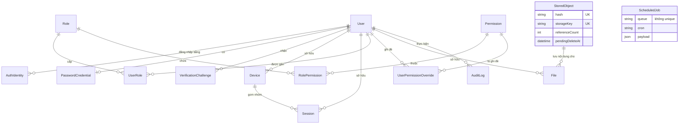

# 03. Bảo mật, phân quyền và database

> File này nhìn hệ thống theo từng lớp bảo vệ. Mỗi lớp nêu điểm đã làm tốt trước, rồi đến lỗ hổng (tham chiếu mã ở `02-VAN-DE-VA-RUI-RO.md`).

## 1. Bức tranh chung

Nền móng bảo mật của dự án **tốt hơn mức thường thấy** ở một bài tập base: argon2id, refresh token lưu hash và có rotation, JWT gắn với session trong DB, challenge dùng một lần và đếm số lần thử, PKCE cho Google, khóa advisory cho bootstrap SUPER_ADMIN. Các lỗ hổng nghiêm trọng **không nằm ở mật mã học**, mà nằm ở hai chỗ:

1. **Phân quyền không được áp ở server** cho cả một nhóm module (SEC-001, SEC-002, ARCH-003).
2. **Ranh giới tin cậy giữa các luồng xác thực** (SEC-017: tài khoản chưa xác minh bị "hợp thức hóa" khi đăng nhập Google; SEC-003: tin `Host` header).

| Lớp | Đánh giá | Vấn đề chính |
| --- | --- | --- |
| Xác thực (authentication) | Khá, có lỗ hổng liên kết tài khoản | SEC-017, SEC-003, ERR-006, SEC-010, SEC-016 |
| Phân quyền (authorization) | Yếu ở Files/Jobs, tốt ở Users/Mail | SEC-001, SEC-002, ARCH-003, SEC-015, SEC-007 |
| Session/token | Tốt về thiết kế, yếu ở phía client | ERR-003, ERR-018, SEC-011, DB-004 |
| Secret/cấu hình | Trung bình | SEC-006, SEC-008 |
| Upload/storage | Trung bình | SEC-004, SEC-012, ERR-005, ERR-020 |
| CORS/rate limit/header | Trung bình | ERR-001, OPS-003, ARCH-001, SEC-005 |
| Injection/XSS | Tốt | SEC-009 (dependency) |
| Database | Khá về mô hình, yếu ở quy trình migration | DB-001, DB-002, DB-005 |

## 2. Xác thực

### 2.1 Đã làm tốt (có bằng chứng)

| Cơ chế | Bằng chứng |
| --- | --- |
| Mật khẩu băm bằng argon2id | `core/security/password.ts` (`type: argon2.argon2id`) |
| Chính sách mật khẩu ≥ 12 ký tự, có hoa/thường/số ở server | `users/password/password.policy.ts`; `schemas/register.schema.ts` |
| OTP/magic link/verify email chỉ lưu SHA-256, có TTL, tối đa 5 lần thử | `auth/challenges/challenge.service.ts` (`issue`, `verify`) |
| Tiêu thụ challenge nguyên tử: `updateMany where consumedAt: null` + kiểm tra `count === 1` | `challenge.repository.ts` (`consume`), `challenge.service.ts` |
| Google OAuth có `state` + PKCE S256, xác minh `id_token` qua JWKS với `issuer`/`audience`, bắt buộc `email_verified` | `oauth/google/google-oauth.strategy.ts` |
| Handoff code một lần, TTL 60 giây, thay vì đưa token lên URL | `oauth/oauth-handoff.service.ts` |
| Bootstrap SUPER_ADMIN khóa bằng `pg_advisory_xact_lock` để chống hai callback đồng thời | `auth/bootstrap/super-admin-bootstrap.service.ts` |
| Pipeline chung: mọi strategy → `identityService.resolve` → `authService.complete` (kiểm tra status, tạo device/session, audit) | `auth/auth.service.ts` |
| Quên mật khẩu không tiết lộ email có tồn tại hay không | `password-reset.service.ts` (`request` luôn trả `accepted`) |

### 2.2 Lỗ hổng

- **SEC-017 (High)**: đăng nhập Google gắn identity vào tài khoản **chưa xác minh** do người khác đăng ký trước, và giữ nguyên mật khẩu của người đó. Chi tiết và sơ đồ tấn công ở file 02. Đây là lỗi *ranh giới tin cậy*: "Google đã xác minh email" chỉ chứng minh người **đang đăng nhập** sở hữu email, không chứng minh người **đã đặt mật khẩu trước đó** sở hữu email.
- **SEC-003 (High)**: link trong email dựng từ `Host`.
- **ERR-006 / ERR-017**: các luồng song song xử lý trạng thái không nhất quán. Google set `emailVerifiedAt` nhưng OTP/magic link thì không; đổi mật khẩu xóa cờ mật khẩu tạm nhưng quên mật khẩu thì không.
- **SEC-016 (Low)**: `mustChangePassword` chỉ được ép ở frontend.
- **SEC-010 (Low)**: dò email qua mã 409 và qua thời gian phản hồi của argon2.
- **ARCH-004 (Low)**: API OTP/magic link vẫn mở dù UI đã gỡ. `POST /auth/otp/request` rồi `/auth/otp/verify` với một email bất kỳ sẽ **tạo tài khoản mới không có mật khẩu** (`identity.service.ts`, nhánh `upsert`). Đây là một đường đăng ký thứ hai mà UI không hiển thị.

## 3. Phân quyền (authorization) và RBAC

### 3.1 Mô hình hiện tại

- Role có `rank` (SUPER_ADMIN 100, ADMIN 50, MEMBER 10, role tùy chỉnh 1–99). User có thể có nhiều role.
- `permissionService.resolve`: user có `maxRank = R` thì nhận permission của **mọi role có rank ≤ R**, sau đó áp override ALLOW/DENY riêng của user.
- `rbacPolicy` (`rbac.policy.ts`): không tự thao tác trên chính mình; actor phải có rank lớn hơn target; không gán rank ≥ 100; chỉ một SUPER_ADMIN; không khóa hoặc gỡ SUPER_ADMIN cuối cùng. Phần policy này được tách riêng và có unit test. Đây là điểm tốt.

### 3.2 Ma trận bảo vệ thực tế

| Nhóm route | Đặc tả yêu cầu | Thực tế | Kết luận |
| --- | --- | --- | --- |
| `/users/*` | permission + rank | `authorize` trên mọi route (trừ `/me`), policy trong service | Đúng, trừ `PATCH /users/:id` (SEC-007) |
| `/users/roles*` | `users.roles.*` | GET dùng `users.read`, mutate dùng `users.roles.assign` | Chạy được, nhưng lệch tên với FE (CODE-002) và không có trần quyền (SEC-015) |
| `/mail/*` | `mail.read/send` | `authorize` cả 6 route | Đúng |
| `/files/*` | `files.*` | **Không có `authorize`**, chỉ kiểm tra chủ sở hữu | Sai (SEC-002) |
| `/files/orphans/*` | quản trị hệ thống | **Mở cho mọi user** | Sai (SEC-002) |
| `/jobs/*` | `jobs.*` | **Không có `authorize`, không validate** | Sai nghiêm trọng (SEC-001) |
| `/auth/sessions/:id` | chủ sở hữu | `findFirst where { id, userId }` | Đúng (không có IDOR) |
| `/files/:id/download`, `/files/:id` | chủ sở hữu | `findOwned(id, ownerId)` | Đúng (không có IDOR) |

**Nhận xét**: phần ownership (ai sở hữu tài nguyên nào) làm tốt, không phát hiện IDOR. Phần function-level (ai được gọi chức năng nào) bị bỏ trống ở hai module mới nhất. Gốc rễ là ARCH-003: permission tồn tại trong seed và UI nhưng không có route nào kiểm tra.

### 3.3 Các đường leo thang quyền

1. **User bất kỳ → quyền hệ thống** qua Jobs API (SEC-001). Đăng ký là mở, nên "user bất kỳ" nghĩa là "bất kỳ ai có email".
2. **ADMIN → mọi permission** qua kế thừa rank cộng với việc sửa quyền role thấp hơn (SEC-015).
3. **ADMIN → nhân bản ADMIN**: `assertCanAssign` cho phép `roleRank <= actorRank` (`rbac.policy.ts:15`), và test `allows admin assigning admin role to member` cho thấy đây là chủ ý. Hệ quả cần biết: một ADMIN bị lộ tài khoản có thể tạo thêm nhiều ADMIN khác, và cơ chế bảo vệ ngang cấp lại khiến ADMIN khác không gỡ được các tài khoản này. Chỉ SUPER_ADMIN gỡ được. Đây là quyết định sản phẩm; cần ghi rõ trong tài liệu.
4. **Kẻ tấn công ngoài → tài khoản người khác, có thể cả SUPER_ADMIN** qua liên kết Google (SEC-017).

## 4. Session và token

| Khía cạnh | Hiện trạng | Đánh giá |
| --- | --- | --- |
| Access token | JWT HS256, 15 phút, chứa `sid`; middleware kiểm tra session còn hoạt động mỗi request | Tốt: thu hồi có hiệu lực ngay (có test `rejects an access token immediately after its session is revoked`) |
| Refresh token | 32 byte ngẫu nhiên, lưu SHA-256, rotation mỗi lần refresh | Tốt về lưu trữ; rotation không nguyên tử (ERR-003); không phát hiện dùng lại token cũ |
| Hết hạn | Refresh gia hạn thêm 30 ngày | Phiên trượt vô hạn (DB-004) |
| Giới hạn phiên | 5, không tự kick (đúng đặc tả) | Thiếu luồng phục hồi (ERR-018) |
| Lưu phía client | access + refresh + user trong `localStorage` | Rủi ro nếu có XSS (SEC-011); đặc tả mục 33 chỉ yêu cầu httpOnly *nếu* dùng cookie |
| Block user | `setBlocked` thu hồi mọi session; refresh kiểm tra `status === ACTIVE` | Đúng đặc tả |
| Thiết bị | FE không gửi `fingerprint` → mọi phiên chung device `anonymous` | ERR-013 |

## 5. Secret và cấu hình

- **Đã xác nhận không lộ secret**: lịch sử git chưa từng commit file `.env` (`git log --all --diff-filter=A` không có kết quả). `backend/.env.example` và `frontend/.env.example` chỉ chứa giá trị rỗng hoặc placeholder. `.gitignore` chặn `.env*` nhưng vẫn giữ `.env.example`.
- **Env được validate bằng Zod** (`config/env.ts`). Đây là thói quen tốt. Vấn đề là nhiều biến quan trọng có `default(...)` nên cấu hình sai vẫn cho khởi động (SEC-006). Nên có hai tầng: default chỉ áp dụng cho development/test, còn production thì thiếu biến là dừng ngay.
- **Secret trong hàng đợi** (SEC-008): OTP, token magic link và mật khẩu tạm (`user.service.ts:170`) được đưa vào payload job, lưu ở bảng của pg-boss và giữ lại trong archive. Logger có redact theo tên key (`password|token|otp|secret`), nhưng bảng job của pg-boss thì không.
- `mail.config.ts` tự bỏ khoảng trắng trong `SMTP_PASSWORD` (hỗ trợ Gmail App Password) và API `/mail/config` che bớt `user`. Đây là chi tiết chu đáo.

## 6. Upload và storage

| Kiểm soát | Hiện trạng | Kết luận |
| --- | --- | --- |
| Giới hạn kích thước | Kiểm tra sau khi đã buffer toàn bộ | Sai thứ tự (SEC-004) |
| MIME whitelist | Có (10 loại), lấy MIME từ header client, fallback theo đuôi file | Có kiểm soát nhưng tin client (SEC-012) |
| Storage key do server sinh | `objects/<2 ký tự hash>/<uuid>` (`upload.service.ts`) | Tốt |
| Chống path traversal | `LocalStorage.safe()` resolve và kiểm tra prefix `root + sep` | Tốt |
| Tên file | Upload thay `\ / \0` bằng `_`; `reuse` nhận `newName` không làm sạch và không giới hạn độ dài | Nên dùng chung một hàm làm sạch |
| Download | `res.attachment(name)`, tức luôn tải về, không render inline | Tốt, giảm rủi ro SVG/HTML |
| Dedup SHA-256 | `hash @unique` + bắt lỗi khi tạo trùng rồi đọc lại | Tốt; nhưng ERR-005, ERR-020 ở khâu xóa |

## 7. CORS, rate limit, header

- `helmet()` bật mặc định, `x-powered-by` tắt, body JSON giới hạn 1MB. Tốt.
- CORS dùng origin cố định từ `FRONTEND_URL` (không dùng `*`), `credentials: true`. Thiếu `PUT` (ERR-001). Cần nhớ CORS chỉ là chính sách của trình duyệt, **không** bảo vệ API trước `curl`/Postman.
- Rate limit: một limiter chung cho mọi route auth (10 request/15 phút/IP), lưu trong RAM (ARCH-001), phụ thuộc `TRUST_PROXY` (OPS-003). `GET /auth/google` và `POST /auth/refresh` không có rate limit.

## 8. Injection và XSS

- **SQL injection**: không phát hiện. Toàn bộ truy vấn qua Prisma. Câu raw duy nhất (`$executeRaw` trong bootstrap) dùng tagged template nên được tham số hóa.
- **HTML injection trong email**: `mergeTemplateValue` escape mọi biến; khi lưu template chỉ chấp nhận biến trong whitelist (`email-template.service.ts`); `sendCustom` escape nội dung. Tốt.
- **XSS phía frontend**: preview template dùng `<iframe sandbox="" srcDoc=...>` (`template-editor.tsx`), cách làm đúng. Có một `dangerouslySetInnerHTML` trong `TemplateGallery` (`mail-manager.tsx`), nhưng component này không được render (dead code, CODE-003). Link trong markdown preview được React 19 chặn `javascript:` (xem điều chỉnh SEC-011).
- **Dependency**: `xlsx 0.18.5` có CVE đã công bố (SEC-009), dùng để đọc file Excel do người dùng chọn.

## 9. Database

### 9.1 Mô hình dữ liệu

Mô hình **hợp lý và chuẩn hóa tốt**:

- Tách `AuthIdentity` khỏi `User` để một user có nhiều cách đăng nhập.
- Tách `StoredObject` (nội dung vật lý) khỏi `File` (tên logic) để dedup.
- Override quyền theo user có khóa chính kép.
- Các khóa ngoại tới `User` có `onDelete: Cascade` hợp lý; `AuditLog.actor` dùng `SetNull` để giữ lại lịch sử.

### 9.2 Constraint và index

| Bảng | Có | Thiếu / rủi ro |
| --- | --- | --- |
| `User` | `email @unique` | — |
| `AuthIdentity` | unique `(provider, providerAccountId)`, index `userId` | — |
| `VerificationChallenge` | index `(email, type, createdAt)`, `expiresAt` | — |
| `Session` | index `(userId, revokedAt, expiresAt)`, `expiresAt` | — |
| `Device` | unique `(userId, fingerprint)` | FE không gửi fingerprint → mọi phiên dùng chung một dòng (ERR-013) |
| `StoredObject` | `hash @unique`, `storageKey @unique`, index `(referenceCount, createdAt)` | Không có CHECK `referenceCount >= 0` (DB-002, ERR-020) |
| `File` | index `(ownerId, deletedAt, createdAt)` | **Không có index `objectId`**, trong khi cleanup `deleteMany where objectId` (DB-002); FK tới `StoredObject` không khai báo `onDelete` (mặc định Restrict) |
| `Role` | `name @unique` | Không ràng buộc khoảng giá trị `rank` ở DB |
| `ScheduledJob` | index `enabled` | `queue` không unique trong khi pg-boss dùng queue làm khóa lịch (ARCH-002) |

### 9.3 Transaction

| Nơi dùng transaction đúng | Nơi thiếu hoặc sai thứ tự |
| --- | --- |
| Bootstrap SUPER_ADMIN (có advisory lock) | Đăng ký: `findUnique` rồi `create` (ERR-012) |
| `identityService.resolve` (upsert user + identity) | Tạo session: đếm rồi tạo (ERR-012) |
| Upload: tăng `referenceCount` + tạo `File` | Refresh: so sánh hash rồi update (ERR-003) |
| `softDelete`, `reuse` | `softDelete` không có điều kiện `deletedAt: null` (ERR-020) |
| Cập nhật quyền role (xóa rồi tạo lại) | Cleanup: xóa storage **trước** transaction DB (ERR-005) |

Bài học chung: **"kiểm tra rồi mới làm" (check-then-act) không an toàn khi có đồng thời**. Cách sửa phù hợp quy mô là dùng unique constraint, update có điều kiện (`updateMany where ...` rồi kiểm tra `count`), hoặc transaction. Chưa cần lock phân tán.

### 9.4 Migration

- DB-001 (Critical): ba thay đổi schema không có migration. Đây là lỗi **quy trình**, không phải lỗi cú pháp: code chạy đúng trên máy học viên nhưng hỏng ở mọi môi trường dựng từ migration.
- Migration `init` được sinh bằng `prisma migrate diff` (README mục 4), sau đó áp thêm 2 migration nhỏ. Không có CI nào đối chiếu schema với migration.

### 9.5 Rủi ro mất hoặc sai lệch dữ liệu

| Rủi ro | Mã | Loại |
| --- | --- | --- |
| File vật lý bị xóa trong khi DB vẫn trỏ tới | ERR-005, ERR-020 | Tiềm ẩn (race) |
| Lỗi cleanup bị nuốt, không ai biết | OPS-005 | Xác nhận |
| "Giữ orphan 10 ngày" không áp dụng cho file cũ | DB-005 | Xác nhận (theo đặc tả) |
| Job xóa audit và tạm khóa user chạy với tham số mặc định thay vì cấu hình | ERR-004 | Xác nhận code |
| Storage local nằm trong container, mất khi redeploy | OPS-002 | Xác nhận |
| Test integration xóa toàn bảng | DB-003 | Xác nhận (đã có rào `corestack_test`) |
| **Lưu ý cho tương lai**: xóa `User` sẽ cascade xóa `File` nhưng không giảm `StoredObject.referenceCount`, nên object thành rác vĩnh viễn. Hiện chưa có API xóa user nên chưa xảy ra. | — | Tiềm ẩn |
